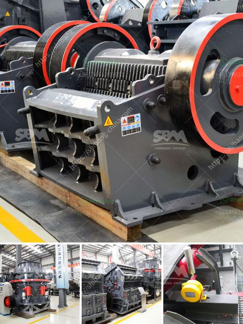

<h3>stone crusher and quarry for sale in pakistan</h3>
Stone crushing and quarrying are the backbone of the construction sector in Pakistan, contributing an estimated 15% to 20% of GDP. The industry, however, remains heavily regulated, leading to illegal practices and inefficient use of resources. Many of these issues could be resolved if certain government policies were implemented effectively.

Stone crushing is a tedious and costly affair for both the crushers and the quarries. On one hand, the crushers have to look for raw material, while on the other hand, the government agencies have to interrogate and punish the illegal quarries. The overall process is energy-intensive and often non-environment friendly.

Although the government has taken several steps to regulate this sector, including the imposition of hefty fines and shutting down illegal operations, the implementation of these policies has been inconsistent. This has led to an increase in the number of illegal stone crushers and quarries. These unregulated operations not only degrade the environment but also undermine the market economy by giving an unfair advantage to those who bypass regulations.

In light of this situation, the sale of stone crushers and quarries in Pakistan can be an attractive investment opportunity. These machines are widely used in mining and construction industry, which makes them highly profitable. The most attractive factor is the low cost of raw materials. The raw materials needed for the production of stone crushers in Pakistan include a large quantity of metals, quarry equipment, and other mining machinery.

With the rapid development of the construction industry, the demand for rough stones, aggregates, and transformed stones is increasing day by day. As a result, the quarrying industry in Pakistan is booming. To date, more than 1000 licenses have been issued for the establishment of stone crushers and quarries across the country.

To further enhance the quality and productivity of the industry, the government should take concrete measures. First, it should strengthen the regulations and strictly enforce them to discourage illegal operations. Second, it should provide incentives and support to the legal mine owners and crushers to upgrade their machinery and technological capabilities. This will not only boost productivity but also ensure the safe and efficient extraction of raw materials.

Moreover, investments in this sector should be protected and encouraged through favorable policies, tax incentives, and streamlined approval processes. Investors should be assured that their investment is safe, and they can enjoy favorable returns on their investment.

In conclusion, the stone crusher and quarry industry in Pakistan is growing rapidly due to the booming construction industry and the increase in demand for raw materials. This article discussed the sale of stone crushers and quarries in Pakistan, and the importance of government policies in this regard. It emphasized the need for consistent enforcement of regulations to curb illegal operations and protect the environment. Furthermore, it highlighted the potential for investment in this sector and the benefits it can bring to the national economy.
<h3>Contact us</h3><ul><li><strong>Whatsapp:&nbsp;<a href="https://wa.me/8613661969651">+8613661969651</a></strong></li><li><a href="https://swt.shibang-china.com/?git&amp;zhl&amp;stone crusher and quarry for sale in pakistan"><strong>Online Service(chat now)</strong></a></li></ul><h3>Related</h3><ul><li><a href='ball mill mesh size.md'>ball mill mesh size</a></li><li><a href='mica powder mill equipment supplier.md'>mica powder mill equipment supplier</a></li><li><a href='hammer crusher clinker.md'>hammer crusher clinker</a></li><li><a href='crusher portable mexico stone crusher.md'>crusher portable mexico stone crusher</a></li><li><a href='barite mining process with photos.md'>barite mining process with photos</a></li></ul>