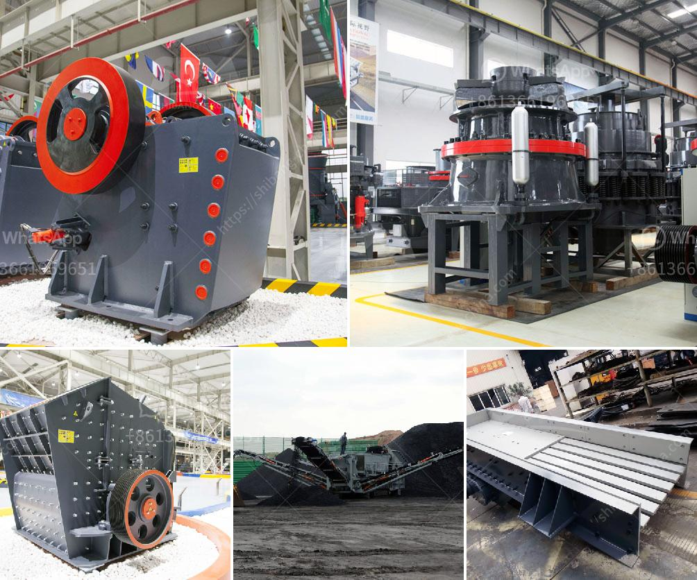

<h3>stone crusher china</h3>
Stone crusher China, the undisputed leader in the field of mining machinery, in our country has reached the international advanced level and ranked among the top in the world. Compared with other counterparts, the high-efficiency stone crusher produced by our company has won the favor of customers.

With increasingly fierce competition in mining machinery market, there are a number of challenges confronting the development of stone crusher China. For example, the issue of environmental pollution caused by stone crushers is becoming more and more serious. In order to solve this problem, our company continuously improves the equipment technology and adopts advanced dust-proof and noise-reducing devices, making stone crushers more environmentally friendly.

In addition, the development of stone crusher China is also closely related to the improvement of infrastructure construction. As the construction industry continues to develop, the demand for stone crushers continues to increase. Our company has continuously focused on technological innovation and developed new stone crushers to meet the market demand. The new stone crushers not only enhance the crushing efficiency, but also improve the overall performance of the equipment and extend the service life.

The Chinese stone crusher manufacturers have been praised by customers not only for their excellent product quality, but also for their sincere service. China's stone crusher manufacturers have always respected the needs of customers and paid great attention to after-sales service. In the future development, our company will continue to adhere to the concept of customer first, and provide more high-quality stone crushers and better service to customers at home and abroad.

In summary, stone crusher China has achieved remarkable achievements in the field of mining machinery and has become one of the key industries in China's construction industry. It plays a significant role in promoting the development of China's economy. With the development of technology and the improvement of stone crusher manufacturers' comprehensive strength, stone crusher machinery in China will have a bright future!
<h3>Contact us</h3><ul><li><strong>Whatsapp:&nbsp;<a href="https://wa.me/8613661969651">+8613661969651</a></strong></li><li><a href="https://swt.shibang-china.com/?git&amp;zhl&amp;stone crusher china"><strong>Online Service(chat now)</strong></a></li></ul><h3>Related</h3><ul><li><a href='kaolin stone crusher.md'>kaolin stone crusher</a></li><li><a href='grinding plant improvement.md'>grinding plant improvement</a></li><li><a href='price of crushers of gravel.md'>price of crushers of gravel</a></li><li><a href='conveyor belt prices malaysia.md'>conveyor belt prices malaysia</a></li><li><a href='sand screeding machine prices.md'>sand screeding machine prices</a></li></ul>