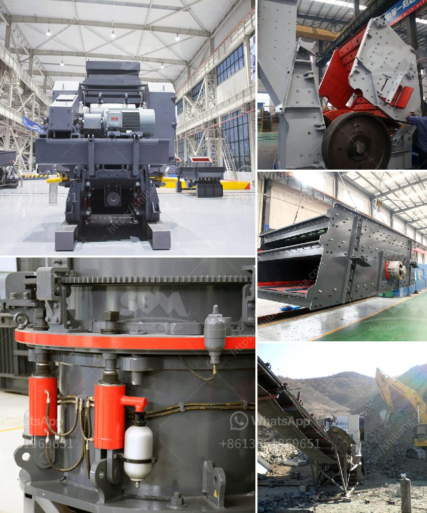

<h3>stone crusher companies in pakistan</h3>
Stone crushing industry is a growing sector in Pakistan and it is also attracting the attention of many investors. This burgeoning industry has been linked with local infrastructural developments as well as providing employment opportunities. For the past couple of years, the stone crushing machinery market in Pakistan has been one of the largest and most prosperous sectors in the country.

The stone crushing industry serves as an essential sector for industrial growth and development. With the advancement of urbanization, the construction of roads, railroads, buildings, and other infrastructures have become the primary driving force for the stone crushing industry. These developments have also created a huge demand for raw materials like gravel, crushed stones, and aggregates.

Pakistan has a wide range of stone crusher companies available for customers to choose from. These companies primarily operate in the real estate, construction, and transportation sectors, with their main focus being on crushing huge stones and rocks to help build beautiful buildings and infrastructures.

One of the prominent companies in this industry is Punjab Stone Crusher, which is known for producing quality construction materials. It employs more than 200 workers, who constantly work towards delivering high-quality products to their customers. The company is known for its reliability and commitment to customer satisfaction. They have a well-diversified product range, including crushed stones, sand, concrete, and asphalt. Punjab Stone Crusher has earned a reputation as a trusted and reliable company due to its consistent performance and timely delivery.

Another noteworthy stone crusher company in Pakistan is S.Zahid Stone Crusher. It is known for its variety of products, including crushed stones, sand, gravel, and more. This company also knows the importance of affordable pricing, offering competitive prices to its customers. With an experienced team of professionals and state-of-the-art machinery, S.Zahid Stone Crusher has established itself as a leading player in the industry.

When it comes to stone crusher companies in Pakistan, Ghousia Stone Crusher is another name that stands out. It offers a wide range of products that are used for various construction purposes such as crushed stones, sand, gravel, and other aggregates. Ghousia Stone Crusher is known for its exceptional customer service and its ability to meet the tight deadlines set by its clients.

In conclusion, stone crusher companies in Pakistan play a crucial role in the development and growth of the country's infrastructure. These companies not only provide construction materials but also create employment opportunities for the local population. With their reliable and efficient services, these companies have earned the trust and respect of their customers. As Pakistan continues to experience urbanization and infrastructural developments, the demand for stone crusher companies is expected to rise. These companies will continue to prosper while contributing to the growth of the construction industry in Pakistan.
<h3>Contact us</h3><ul><li><strong>Whatsapp:&nbsp;<a href="https://wa.me/8613661969651">+8613661969651</a></strong></li><li><a href="https://swt.shibang-china.com/?git&amp;zhl&amp;stone crusher companies in pakistan"><strong>Online Service(chat now)</strong></a></li></ul><h3>Related</h3><ul><li><a href='coal crusher design calculation.md'>coal crusher design calculation</a></li><li><a href='crusher 50 ton per hour price.md'>crusher 50 ton per hour price</a></li><li><a href='ball mill small for sale.md'>ball mill small for sale</a></li><li><a href='ore crushers benoni.md'>ore crushers benoni</a></li><li><a href='sayaji jaw crusher vadodara.md'>sayaji jaw crusher vadodara</a></li></ul>