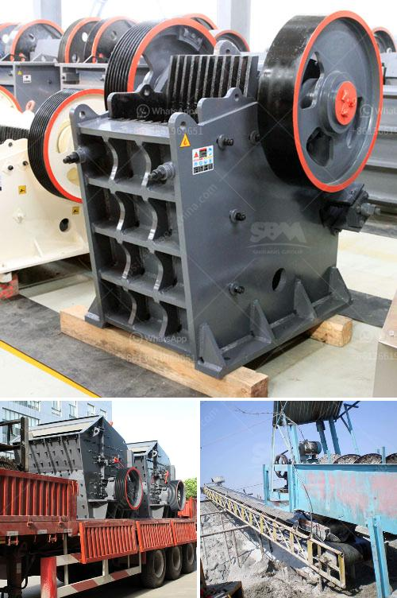

<h3>stone crusher equipment manufacturer made in canada</h3>
Stone crushing equipment has been a staple in the mining industry for centuries. From the humble beginnings of early civilizations to present-day technological advancements, stone crushers have played a vital role in the efficient processing of raw materials. The Canadian stone crusher equipment manufacturer has become one of the most reputable manufacturers in the industry with a tenure that spans over several decades.

When investing in stone crushing equipment, it's crucial to find a manufacturer that is reputable and capable of providing high-quality machinery that meets your specific needs. Canadian manufacturers excel in this aspect, offering a wide range of equipment that caters to various applications.

What sets Canadian stone crusher equipment manufacturers apart is their commitment to technological advancements. They invest heavily in research and development to deliver cutting-edge machinery that improves efficiency and productivity. These manufacturers understand the importance of adapting their equipment to suit the ever-evolving requirements of the industry.

Another noteworthy aspect of Canadian stone crusher equipment manufacturers is their unmatched after-sales service. They recognize that their commitment to customers extends beyond the sale of machinery. Therefore, they offer comprehensive support, including installation, training, and maintenance services, ensuring that customers can optimize their equipment and achieve maximum productivity throughout its lifespan.

The made-in-Canada stamp on stone crusher equipment represents the assurance of exceptional quality. Canadian manufacturers consistently deliver reliable and durable machinery designed with a focus on energy efficiency and environmental sustainability.

Overall, Canadian stone crusher equipment manufacturers have a strong reputation for providing high-quality machinery that performs exceptionally well in various mining and quarrying applications. With a commitment to technological advancements and excellent after-sales support, they are a reliable choice for any investor looking to optimize their stone crushing operations.
<h3>Contact us</h3><ul><li><strong>Whatsapp:&nbsp;<a href="https://wa.me/8613661969651">+8613661969651</a></strong></li><li><a href="https://swt.shibang-china.com/?git&amp;zhl&amp;stone crusher equipment manufacturer made in canada"><strong>Online Service(chat now)</strong></a></li></ul><h3>Related</h3><ul><li><a href='marble crusher manufacturer.md'>marble crusher manufacturer</a></li><li><a href='stone crusher companies in pakistan.md'>stone crusher companies in pakistan</a></li><li><a href='barite grinding plant machine sale.md'>barite grinding plant machine sale</a></li><li><a href='crusher for rent in malaysia.md'>crusher for rent in malaysia</a></li><li><a href='german crushing stone plant.md'>german crushing stone plant</a></li></ul>