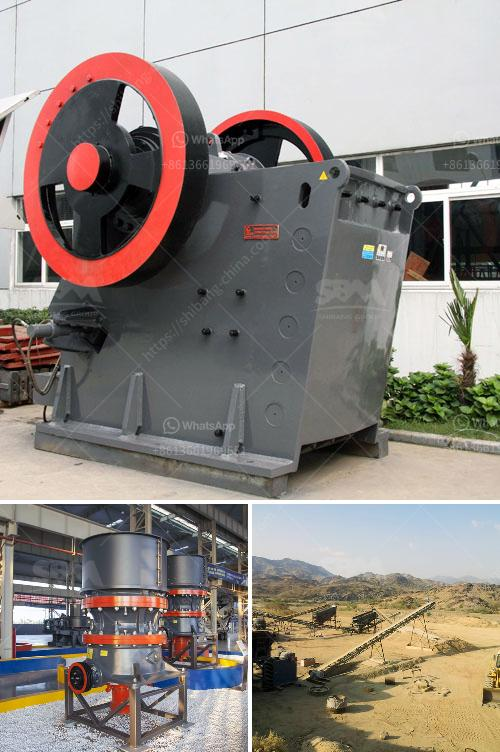

<h3>stone crusher equipment supplier</h3>
Crushing machines have been widely used in construction, mining, metallurgy, chemical, electric power, ceramics, highway construction and other industries. The development of mining industry brings plenty of opportunities for the manufacturers of stone crusher equipment. Stone crushing machines are used for breaking large stones into smaller pieces for obtaining desirable and valuable products in various industries. 

There are different types of crushers available in the market, including cone crushers, jaw crushers, impact crushers, and others, which have their own advantages and different applications. A stone crusher is a machine used to convert large stones into smaller sizes that can be used in construction or other purposes. There are several types of stone crushing machines, which are differentiated based on the stone processing stages, namely primary crusher, secondary crusher, and tertiary crusher.

Stone crusher equipment suppliers provide stone crushing machines to different individuals, industries, and organizations. The stone crushing machine supplier has a strong and reliable team, which can guarantee the timely delivery of products and services. In case of any queries or doubts, professionals are always available for assistance. Stone crushing machines are economical, durable, and efficient, with high-quality construction for their working mechanism.

When it comes to stone crusher equipment supplier, there are several factors that are important to consider, including experience and track record. These aspects determine the credibility and trustworthiness of the supplier, ensuring that they will deliver reliable and high-quality products. Additionally, it is essential to choose a supplier that offers after-sales service and support to ensure the smooth functioning of the equipment.

In conclusion, stone crusher equipment suppliers provide stone crushing machines that have a wide range of applications in various industries. They can be used for primary, secondary, and tertiary crushing to meet different requirements. Stone crusher equipment suppliers have their own advantages, which provide better customer satisfaction, along with the best quality products.
<h3>Contact us</h3><ul><li><strong>Whatsapp:&nbsp;<a href="https://wa.me/8613661969651">+8613661969651</a></strong></li><li><a href="https://swt.shibang-china.com/?git&amp;zhl&amp;stone crusher equipment supplier"><strong>Online Service(chat now)</strong></a></li></ul><h3>Related</h3><ul><li><a href='iron ore mines cost structure.md'>iron ore mines cost structure</a></li><li><a href='mill grinder for sale.md'>mill grinder for sale</a></li><li><a href='mineral beneficiation screening ppt.md'>mineral beneficiation screening ppt</a></li><li><a href='suppliers chrome mining equipment in zimbabwe.md'>suppliers chrome mining equipment in zimbabwe</a></li><li><a href='price list of stone crusher in india.md'>price list of stone crusher in india</a></li></ul>