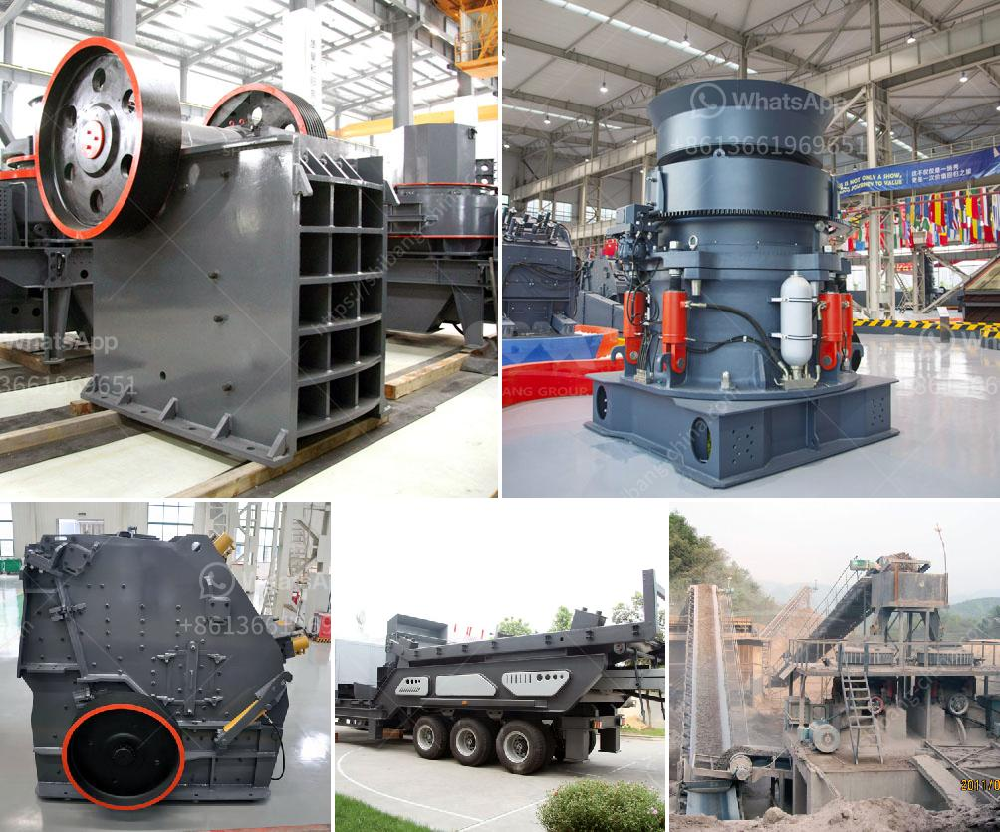

<h3>stone crusher factory</h3>
Stone crushing industry is an important industrial sector in the country engaged in producing crushed stone of various sizes depending upon the requirement which acts as raw material for various construction activities such as construction of roads, highways, bridges, buildings, canals etc. It is estimated that there are over 15,000 stone crusher units in India. The number is expected to grow further keeping in view the future plans for development of infrastructure of roads, canals and buildings.

Stone crushing units are not stand alone crushing units, but stone mining is also associated with this activity; in fact stone mining is the primary and basic activity for the stone crushing units. Therefore this kind of industrial units need scrutiny while granting permission for environmental and mining operations, especially at the time of NOC (i.e. Consent to Establishment) stage. It should be analyzed in totality.

i) The suspended particulate matter (SPM) released due to stone crushing activities contains impurities like clay, sand, benzene, petroleum ether, mythelene chloride, or polycyclic aromatic hydrocarbons. It can cause several respiratory diseases and permanent lung damage.

ii) Silica content in the stone is significantly high which poses a serious health hazard when it is inhaled. It gets deposited in lungs and causes diseases like silicosis, kidney stones, lung cancer, and chronic obstructive pulmonary disease (COPD).

iii) Noise pollution is caused due to operation of the crusher units. Traffic noise is considered to be one of the dominant environmental noise sources in urban areas. In civil engineering sites, noise pollution is the most dominant environmental noise sources among construction machinery.

iv) The crusher owners have refused to supply stones and others material till the issue is resolved. i.e. from Saturday till now on. There are around 80 stone crushing units in Kangra district on private land, which means that mining owners are still not being able to operate these units so far. It has been almost 20 days, and now it looks like the units are not going to start creating any revenue for mining owners till the issue is resolved. This issue has been in limbo since December last year, when NGT issued a notice to all mining and related industries in the state and directed to stop operation within weeks. It all started when these units went ahead with the process of installation of crushers around 200 meters from a school building, which is in violation of a rule, and against the norms set by High Court of State. The result was disastrous for the school as the students started falling sick one by one, for which the entire area was evacuated and the school was shut down. On restart of the school, mining owners again started installation of the stone crushers in margins of a national highway, obstructing the traffic between Manali to Leh and further annoyed the people of the area.

v) The stone crushing units are needed to be immediately stopped as taking action against them under EPA-1986 along with mining act and other relevant regulations. The stone crushing units in the vicinity had shut down operations for the last three days due to heavy rains and are presently continuing their operations illegally, anticipating an early disruption for indefinite period.

In conclusion, stone crusher industry has grown significantly in recent years due to its high demand, levels of affluence and environmental concerns. However, to sustain its development, the stone crushing industry must face more challenges, such as the deepening of reserves, market saturation, legal regulations, and environmental protection and rehabilitation measures. The government should also create appropriate policies and regulations to safeguard the rights and interests of both the stone crusher factories and the affected individuals and communities.
<h3>Contact us</h3><ul><li><strong>Whatsapp:&nbsp;<a href="https://wa.me/8613661969651">+8613661969651</a></strong></li><li><a href="https://swt.shibang-china.com/?git&amp;zhl&amp;stone crusher factory"><strong>Online Service(chat now)</strong></a></li></ul><h3>Related</h3><ul><li><a href='price of stone crusher machine in pakistan.md'>price of stone crusher machine in pakistan</a></li><li><a href='second hand diesel hammer mill for sale south africa.md'>second hand diesel hammer mill for sale south africa</a></li><li><a href='crusher plant dengan kapasitas 100 ton h.md'>crusher plant dengan kapasitas 100 ton h</a></li><li><a href='properties of gold mining in south africa.md'>properties of gold mining in south africa</a></li><li><a href='gypsum plants in india.md'>gypsum plants in india</a></li></ul>