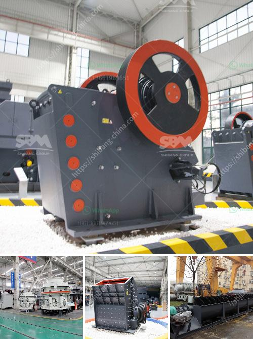

<h3>stone crusher for quarry stone</h3>
Stone crusher is a necessary equipment for the quarry stone production line. The equipment includes crushers for primary crushing, crushers for secondary crushing, and crushers for tertiary crushing. What are the types of stone crushers and what are the advantages and disadvantages of each?

The following article mainly introduces the advantages and disadvantages of the common stone crushers for the quarry stone crusher production line.

The quarry stone crusher production line is mainly composed of vibrating feeder, jaw crusher, impact crusher, vibrating screen, belt conveyor and electric control system. Its capacity ranges from 50 to 1000 t/h. Different requirements can be met according to the various types of raw materials, size and finished product requirements. According to the working principle, the stone crusher can be divided into jaw crusher, impact crusher, cone crusher, hammer crusher, roller crusher, etc.

Quarry stone crusher is widely used to process stone into various shapes and sizes, such as aggregate and sand. In addition to reducing the size of materials, it can also be used to produce different sizes of stones and sand. The advantages of stone crusher for quarry stone are mainly reflected in the following aspects:

1. The crushed stone can be used as gravel for construction, road construction, etc., and can also be used as a raw material for concrete.

2. The crushed stone can be divided into two types of stones by the vibrating sieve: coarse crushing and medium crushing.

4. The cone crusher has a large crushing ratio, which is suitable for medium and fine crushing of materials with higher hardness.

5. The roller crusher has a simple structure and reliable operation, so it has been widely used in quarrying and mining industries.

Of course, the stone crusher price is higher than the low-priced equipment. A manufacturer with good quality and great performance will have a higher price. Generally, speaking, the higher the type, the higher the price. For example, the price of a jaw crusher with a capacity of 200-300 t/h can be higher than that of a jaw crusher with a capacity of 1000 t/h, because the jaw crusher with a larger capacity has more complex structure and more components, so the initial investment is higher. In addition, the price of the same type of stone crusher will be different in different regions and different manufacturers.

In summary, we can analyze the advantages and disadvantages of the quarry stone crusher. Some stone crushers have relatively small sizes and capacities, so the investment cost is relatively low; the production cost is relatively low, but the finished stone has a large particle size and poor grain shape; the cost of operating and maintaining the equipment is relatively high. Therefore, when choosing a stone crusher, you should choose according to your own production situation, production requirements, investment budget, etc., so as to choose the most suitable equipment for yourself and maximize the benefits.
<h3>Contact us</h3><ul><li><strong>Whatsapp:&nbsp;<a href="https://wa.me/8613661969651">+8613661969651</a></strong></li><li><a href="https://swt.shibang-china.com/?git&amp;zhl&amp;stone crusher for quarry stone"><strong>Online Service(chat now)</strong></a></li></ul><h3>Related</h3><ul><li><a href='ball mill price list philippines.md'>ball mill price list philippines</a></li><li><a href='portable cedar rapids rock crusher.md'>portable cedar rapids rock crusher</a></li><li><a href='used stone cursher machinery in uae.md'>used stone cursher machinery in uae</a></li><li><a href='machinery for copper plant.md'>machinery for copper plant</a></li><li><a href='ball mill 25 tons per hour price.md'>ball mill 25 tons per hour price</a></li></ul>