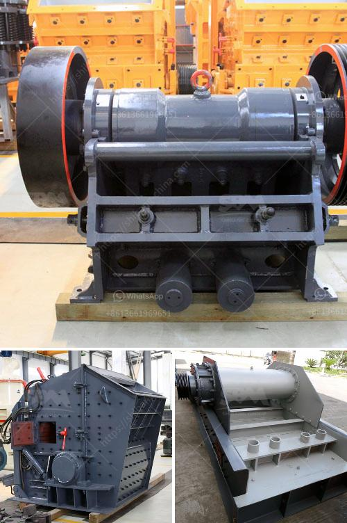

<h3>stone crusher for rent</h3>
Stone crusher is a machine designed to reduce large rocks into smaller rocks, gravel, or rock dust. Crushers may be used to reduce the size, or change the form, of waste materials so they can be more easily disposed of or recycled, or to reduce the size of a solid mix of raw materials, so that pieces of different composition can be differentiated. Crushing is the process of transferring a force amplified by mechanical advantage through a material made of molecules that bond together more strongly, and resist deformation more, than those in the material being crushed do.

Stone crushers are highly effective machines used for crushing and screening rocks and other minerals. They are widely used in mining, construction, metallurgical industries, and other fields. The stone crusher is widely used in mining, building materials, chemical industry, metallurgy and so on.

The stone crusher is suitable for crushing and shaping of stone materials with different hardness levels. These include granite, quartz stone, sandstone, limestone, marble, basalt, and various other rocks. They are also available in various sizes and capacities ranging from 3 tph to 500 tph.

With the continuous development of infrastructure and urbanization projects, there is a constant demand for stone crushers. There are a few different types of crushers that are used to crush stone, including jaw crushers, cone crushers, hammer crushers, and impact crushers. Using compression, jaw crushers feature two "jaw-like" surfaces. Referred to as jaws, jaw crushers have a fixed jaw and a mobile jaw. The mobile jaw enables crushing by exerting force on the stone and forcing it against the fixed jaw.

Cone crushers, on the other hand, are more similar to a gyratory crusher than a jaw crusher. Cone crushers are even more conically-shaped, with a large top opening for loading the large materials and a much smaller bottom opening for the much smaller, crushed materials to exit. Typically, cone crushers function by squeezing the materials between an eccentrically gyrating spindle and a concave hopper.

Hammer crushers use rotating hammer-like rotors to reduce larger rocks into smaller pieces and they have primary impact features. Impact crushers are widely used in the mineral processing and construction industries as they are able to crush ores, rocks, and chemical materials. These machines are designed to maximize crushing performance in a wide range of applications such as limestone, dolomite, gravel, basalt, copper ore, construction waste, concrete, and iron ore.

For those looking to rent a stone crusher, there are a few considerations that need to be taken into consideration to ensure that you are not overpaying for renting a machine. Firstly, make sure that the machine you are renting is capable of crushing the specific material you need. Different materials have different properties and can require different types of crushers to process. Secondly, ensure that the machine is in good working condition and has been properly maintained. Lastly, compare rental rates from different suppliers to ensure that you are getting the best deal.

When considering a stone crusher for rent, keep in mind a few important factors to ensure you are selecting the right equipment. Choosing the right equipment will ensure the stone is crushed effectively for the job at hand. Highly effective stone crusher is a vital piece of equipment for any construction, mining, or industrial project. With the high cost of purchasing the stone crushing equipment, many quarry owners and contractors have a preference for renting the crushers. As opposed to buying, renting equipment can save a significant amount of money in the long run.

Renting a stone crusher also allows you to try before you buy, ensuring that the machine you're renting is the right one for your needs. This will help you make better decisions and ensure that you are getting the optimal machine for your construction projects.

In conclusion, stone crushers are important equipment for construction projects. Along with the enhancement of industrialization and infrastructure projects, the demand for stone crushing machinery is steadily increasing. To choose the right crusher for your needs, consider the following factors: the raw materials, size, hardness, desired output, and budget. Renting a stone crusher allows you to invest less cash and to turn older equipment into cash fast! Submitting your classified ad online could not be easier. Simply classifieds.indiamart.com and go to the "Sell" section to view the range of listings.
<h3>Contact us</h3><ul><li><strong>Whatsapp:&nbsp;<a href="https://wa.me/8613661969651">+8613661969651</a></strong></li><li><a href="https://swt.shibang-china.com/?git&amp;zhl&amp;stone crusher for rent"><strong>Online Service(chat now)</strong></a></li></ul><h3>Related</h3><ul><li><a href='mobile crusher 70 ton.md'>mobile crusher 70 ton</a></li><li><a href='buy crusher of pact in peru.md'>buy crusher of pact in peru</a></li><li><a href='vertical mill working principle of the hydraulic.md'>vertical mill working principle of the hydraulic</a></li><li><a href='alluvial chrome wash plant.md'>alluvial chrome wash plant</a></li><li><a href='limestone crushing process.md'>limestone crushing process</a></li></ul>