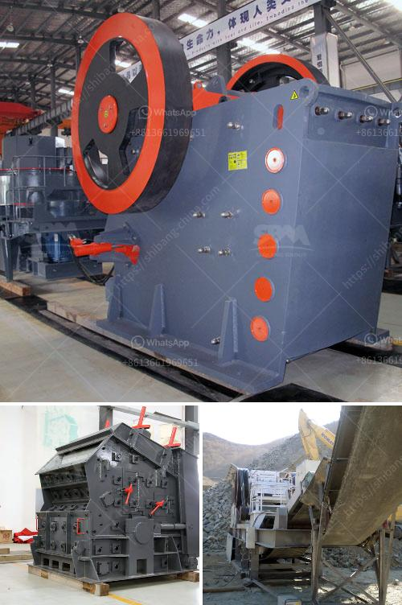

<h3>stone crusher hyderabad</h3>
Hyderabad stands out as a cosmopolitan city with a flourishing technology and industrial sector. With its huge infrastructure, it promises immense opportunities for growth and development to its residents. The construction industry plays a vital role in transforming Hyderabad into a modern metropolis. Stone crushers, crucial components of this industry, are necessary for breaking down larger stones into smaller ones that can be used for a variety of purposes.

Stone crushers perform a crucial role in the crushing industry by providing valuable construction materials, thereby helping the builders to keep up with the growing demand. The market for stone crushers in Hyderabad is expected to grow at a compound annual growth rate (CAGR) of around 6.7% during the forecast period.

One of the key drivers for this growth is the rising urbanization in Hyderabad. With the increase in population, the demand for housing and infrastructure has also risen. Stone crushers are essential in the construction of new residential areas, roads, bridges, and commercial buildings. They contribute to the structural integrity and aesthetic appeal of these constructions.

The stone crushing industry is characterized by the presence of several key players in Hyderabad, like Propel Industries, Jai Kaila Devi Stone Crusher, Conveyortech Engineers, and others. These players constantly aim to expand their geographical presence and increase their customer base. Currently, the players are leveraging technological advancements to enhance their crusher performance and meet the growing demands of the construction industry.

Stone crushers in Hyderabad are primarily used for crushing stones into smaller sizes for various construction applications. They are mostly found in the vicinity of the major construction projects or along the periphery, where stone availability is high. The stone crushing machines are classified based on the nature of the raw materials they process.

Hyderabad is known for its granite deposits, making stone crushers a key equipment for processing this material. The city is one of the major granite manufacturing and trading centers in India and exports high-quality granite products to various countries. Some of the major granite varieties found in Hyderabad include Steel Grey, Black Galaxy, Tan Brown, and Kashmir White.

To meet the demand for durable and aesthetically pleasing construction materials, stone crushers need to operate efficiently and without any disruptions. The maintenance and servicing of these machines play a crucial role in ensuring their smooth functioning. Regular maintenance, timely repairs, and replacement of worn-out parts are necessary to maximize the productivity and longevity of stone crushers.

The stone crushing industry in Hyderabad faces some challenges due to strict environmental regulations. To mitigate these concerns, stone crushers are equipped with dust suppression systems to minimize the emission of dust and comply with environmental norms. Additionally, efforts are being made to promote the use of stone crushers as a sustainable alternative to traditional construction practices.

In conclusion, stone crushers in Hyderabad are instrumental in enhancing the industrial growth of the city. They provide essential construction materials required for infrastructure development and urbanization. With their efficient operation and compliance with environmental regulations, stone crushers contribute to the sustainable progress of Hyderabad's construction industry. As the city continues to grow, the demand for stone crushers is expected to rise, further driving the economic development of the region.
<h3>Contact us</h3><ul><li><strong>Whatsapp:&nbsp;<a href="https://wa.me/8613661969651">+8613661969651</a></strong></li><li><a href="https://swt.shibang-china.com/?git&amp;zhl&amp;stone crusher hyderabad"><strong>Online Service(chat now)</strong></a></li></ul><h3>Related</h3><ul><li><a href='ton grinding unit cement plant cost.md'>ton grinding unit cement plant cost</a></li><li><a href='stone crusher machine for rent in kenya.md'>stone crusher machine for rent in kenya</a></li><li><a href='crusher machine factories in coimbatore.md'>crusher machine factories in coimbatore</a></li><li><a href='granite processing plant.md'>granite processing plant</a></li><li><a href='stone sand making machine in nignia.md'>stone sand making machine in nignia</a></li></ul>