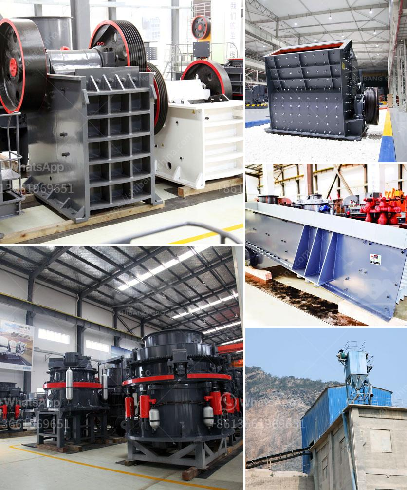

<h3>stone crusher importer in ethiopia</h3>
Ethiopia is one of the largest and fastest-growing economies in Africa. However, despite the country's recent economic success, it is still one of the poorest countries in the world. The majority of the population lives in rural areas, and agriculture is the primary source of income for most households. In these rural areas, access to basic infrastructure and services, such as roads and electricity, is limited.

Stone crushing industry plays a vital role in the economy and urban development of fast-growing countries like Ethiopia. Stone crushers are extensively used to crush bulk and heavy stones into different sizes efficiently and reliably, be it at quarries or recycling plants.

The stone crushers that are typically used as primary crushers, or the first step in the process of reducing rock, extract this stone directly from the earth which prevents them from using modern machinery to crush their product. These are mostly hand-operated. Since the demand for building materials is so high, the need for machines like these is immense.

To meet this growing demand, stone crusher manufacturers have started to invest in the international market, creating opportunities for foreign importers in the sector. As a local importer, it is crucial that you understand the market and the regulations surrounding this industry.

One of the key factors that a stone crusher importer needs to understand is that the machinery used to crush stones is an expensive investment that takes considerable time to set up and install. Therefore, it is crucial to find reliable suppliers that can provide quality machines and after-sales support.

Ethiopia has a renowned stone crusher manufacturing industry that is supported by a strong network of suppliers. Apart from the crushers, manufacturers also offer various other product lines used in construction, mining, and hydraulic engineering.

One of the leading stone crusher manufacturers in Ethiopia is Shakti Mining Equipment Pvt Ltd. They provide a wide range of machinery including conveyors, crushers, stackers, and reclamation equipment. The renowned brand's products are renowned for their heavy-duty construction, durability, and superior performance.

As a stone crusher importer, it is essential to provide quality machines that can withstand the harsh conditions of the industry and deliver consistent performance. Shakti Mining Equipment Pvt Ltd has extensive experience in their field and has earned a solid reputation as a reliable supplier.

In conclusion, the stone crusher market in Ethiopia is growing at a rapid pace and foreign investment is a key driver of this growth. A reliable and efficient supplier can help you capitalize on the opportunities presented by the country's booming construction industry. Shakti Mining Equipment Pvt Ltd is a renowned brand that offers quality machinery and after-sales support for stone crusher importers in Ethiopia.
<h3>Contact us</h3><ul><li><strong>Whatsapp:&nbsp;<a href="https://wa.me/8613661969651">+8613661969651</a></strong></li><li><a href="https://swt.shibang-china.com/?git&amp;zhl&amp;stone crusher importer in ethiopia"><strong>Online Service(chat now)</strong></a></li></ul><h3>Related</h3><ul><li><a href='clinker plant cost.md'>clinker plant cost</a></li><li><a href='crushing jaw crusher.md'>crushing jaw crusher</a></li><li><a href='granite stone hand engraving machine in india.md'>granite stone hand engraving machine in india</a></li><li><a href='ball mill machine.md'>ball mill machine</a></li><li><a href='argentina hammer mills manufacturers.md'>argentina hammer mills manufacturers</a></li></ul>