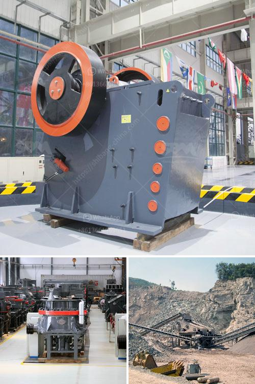

<h3>stone crusher in uk</h3>
Stone crushing industry is an important industrial sector in the country engaged in producing crushed stone of various sizes depending upon the requirement which acts as raw material for various construction activities such as construction of roads, highways, bridges, buildings, canals etc. It is estimated that there are over 12,000 stone crusher units in UK.

The demand for stone crusher will continue to increase with the growth of its user industry. The unit can be set up depending availability of raw material and major commercial centre. Stone crushed by stone crusher is segregated into various sizes like 35mm, 20mm, 12mm, etc for different uses. The final product size can be adjusted depending on the form and seat of tooth.

Crushing is an important stage in stone processing operation. Stone crushing generally can be processed in three stages: primary crushing, secondary crushing and tertiary crushing. SBM is global supplier and manufacturer of stone crushing plant. We developed complete range of large and small stone crusher plant for sale in UK. Here are some popular types.

With the accumulation and development of many years, we are able to offer premium quality primary jaw crusher machine. With the jaw movement, the upper jaw plate moves forward and down to squeeze the material in the crushing chamber. Inside the cavity, the two jaw plates dynamically squeeze and bite the raw materials. The movement of the crushing jaw can be quite small, since complete crushing is not performed in one stroke.

Secondary impact crusher can be equipped with horizontal shaft and vertical shaft impact crusher. The inclined screen provides new possibilities in mobile crushing. The Unique characteristics of mobile impact crusher station have been fully solved the problem of the high operation rate of the crusher, the adjustment of the discharge size can be realized in the assembly process, and the operation is simple.

Tertiary Cone Crusher Machine mainly consists of frame, horizontal axis, cone brake, balance wheel, eccentric sleeve, upper crushing wall (welding cone), down crushing wall (movable cone), fluid coupling and various hydraulic systems.

With the continuous development of mining technology and increased demand, our company produced a variety of cone crushers with affordable price, according to their models, they are divided into Spring Cone Crusher, Compound Cone Crusher(Symons Cone Crusher), Hydraulic Cone Crusher, Multi Cylinder Hydraulic Cone Crusher and Single Cylinder Hydraulic Cone Crusher.

Stone crushers are also called rock breakers, which are essential equipments in mining crushing process. The major types of stone crusher machines are jaw crusher, impact crusher, cone crusher, hammer crusher, roll crusher, compound crusher, etc. Jaw Crusher is a traditional crushing machine and also the earliest one. It is composed to two jaw plates, like those of animals. It can also be called jaw crusher machine and stone jaw crusher.

According to the model size, jaw crushers can be divided into primary jaw crusher, medium jaw crusher and fine jaw crusher. Generally speaking, the smaller the machine is, the finer the fineness will be. Jaw crushers have simple working principle, reliable operation and convenient maintenance, so that they are the first choice for primary crushers in the crushing production line.
<h3>Contact us</h3><ul><li><strong>Whatsapp:&nbsp;<a href="https://wa.me/8613661969651">+8613661969651</a></strong></li><li><a href="https://swt.shibang-china.com/?git&amp;zhl&amp;stone crusher in uk"><strong>Online Service(chat now)</strong></a></li></ul><h3>Related</h3><ul><li><a href='jaw crusher plant saudi.md'>jaw crusher plant saudi</a></li><li><a href='small scale iron ore processing plants sale.md'>small scale iron ore processing plants sale</a></li><li><a href='ball mills china.md'>ball mills china</a></li><li><a href='fortius roller mill.md'>fortius roller mill</a></li><li><a href='calcium carbonate micronized plants.md'>calcium carbonate micronized plants</a></li></ul>