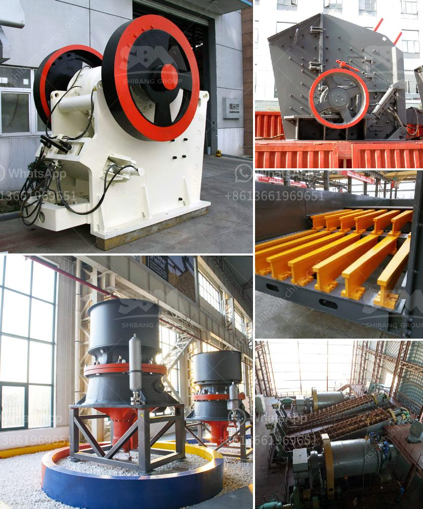

<h3>stone crusher jaw 40 ton jam harga</h3>
Stone crusher jaw 40 ton jam harga is a common type crusher that is commonly used by mining and construction industries. It is designed to crush large rocks into smaller pieces so that they can be used for various purposes such as building materials, paving stones, and landscaping. Stone crusher jaw 40 ton jam harga is widely used in various industries, such as mining, construction, and metallurgy, to crush different types of materials, such as rocks, marbles, granites, and iron ore.

The stone crusher jaw 40 ton jam harga is designed with a simple structure, which allows for easy operation, maintenance, and repair. In addition, it is lightweight, portable, and easy to transport. This means that it can be used in remote areas where power supply is limited or unavailable. It also has a low noise level, making it suitable for use in residential areas.

One of the main advantages of stone crusher jaw 40 ton jam harga is its versatility. It can be used for crushing materials of various hardness levels, ranging from soft to very hard. This makes it suitable for different types of applications, such as primary crushing, secondary crushing, and fine crushing. In addition, it can crush materials of various sizes, ranging from small pieces to large rocks.

Another advantage of stone crusher jaw 40 ton jam harga is its high efficiency. It has a high crushing ratio, which means that it can efficiently crush large rocks into smaller pieces. This results in a higher production rate and a lower energy consumption. It also has a wide feed opening, which allows for a high throughput rate. This means that it can crush more materials in a shorter amount of time, increasing productivity.

Stone crusher jaw 40 ton jam harga is also equipped with an automatic discharge setting, which allows for a precise and consistent product size. This means that it can produce a uniform product size, ensuring that all the crushed materials have the same specifications. This is important in industries that require consistent and high-quality materials, such as construction and paving.

In conclusion, stone crusher jaw 40 ton jam harga is a versatile and efficient type of crusher that is commonly used in the mining and construction industries. It has a simple structure, low noise level, and is lightweight and portable. It has a high crushing ratio and can efficiently crush different types of materials of various sizes and hardness levels. It is also equipped with an automatic discharge setting, ensuring a precise and consistent product size. Stone crusher jaw 40 ton jam harga is a reliable and cost-effective solution for crushing large rocks into smaller pieces for various applications.
<h3>Contact us</h3><ul><li><strong>Whatsapp:&nbsp;<a href="https://wa.me/8613661969651">+8613661969651</a></strong></li><li><a href="https://swt.shibang-china.com/?git&amp;zhl&amp;stone crusher jaw 40 ton jam harga"><strong>Online Service(chat now)</strong></a></li></ul><h3>Related</h3><ul><li><a href='cement plant business plan.md'>cement plant business plan</a></li><li><a href='kaolin stone crusher.md'>kaolin stone crusher</a></li><li><a href='sand washer machine.md'>sand washer machine</a></li><li><a href='artificial plant quartz plant india.md'>artificial plant quartz plant india</a></li><li><a href='hammer mill components.md'>hammer mill components</a></li></ul>