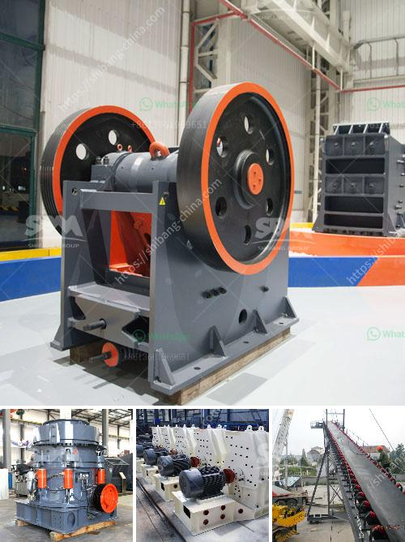

<h3>stone crusher machine 100 cm</h3>
Stone crusher machine is widely used in the mining industry, construction materials industry, and chemical industry. It can be used to crush heavy metal ores such as gold ore, silver ore, copper ore, manganese ore, zinc ore, lead ore, etc. The main engine of the stone crusher machine is composed of a mainframe, an eccentric shaft, a large belt pulley, a flywheel, a side guard plate, a toggle plate, a rear bracket, an adjusting clearance screw, and a return spring. 

The working principle of a stone crusher machine is very simple. The first thing to consider is the crusher's materials, which are usually mined rocks. The process starts by breaking the large stones into smaller pieces. The machine then uses pressure to crush stones, reducing their size. Once the stones are through the gyratory crusher, they are placed on a conveyor belt that transports them to a vibrating screen. Then the output will be divided into various sizes depending on the customer's requirements. 

The stone crusher machine provides high-quality materials, especially for motorway,high-speed railway, tall building, city project, hydroelectric dam construction, and mixing station. The capacity is 50-800tph, which is a medium-high capacity. The material size can be divided into three specifications: medium, large, and small. The feed size of the machine is less than 500 mm, and the compressive strength of material to be crushed should not exceed 350 MPa. 

Different materials meet different requirements, so customers can customize according to their needs. These stone crusher machines are used to crush stone rocks into smaller particles in order to satisfy various industrial use-cases. Therefore, select the crusher that can handle the material you want to crush, as it will depend on the type of feed material and final product demanded. 

In conclusion, stone crusher machine is absolutely crucial to breaking down stones into fine particles to achieve an optimal size. The main objective of this machine is to provide different sizes of stone crushers depending on the customer's requirements. What you gain from purchasing the right stone crushing machinery will depend on various factors including the material to be crushed, maintenance costs, longevity of wear parts, and space needed to house the stone crusher.
<h3>Contact us</h3><ul><li><strong>Whatsapp:&nbsp;<a href="https://wa.me/8613661969651">+8613661969651</a></strong></li><li><a href="https://swt.shibang-china.com/?git&amp;zhl&amp;stone crusher machine 100 cm"><strong>Online Service(chat now)</strong></a></li></ul><h3>Related</h3><ul><li><a href='100tph coal crushing process.md'>100tph coal crushing process</a></li><li><a href='jaw crusher technical parameter.md'>jaw crusher technical parameter</a></li><li><a href='jaw crusher pe 1000 x.md'>jaw crusher pe 1000 x</a></li><li><a href='gypsum production line.md'>gypsum production line</a></li><li><a href='rock crusher for crushing balsalt stone.md'>rock crusher for crushing balsalt stone</a></li></ul>