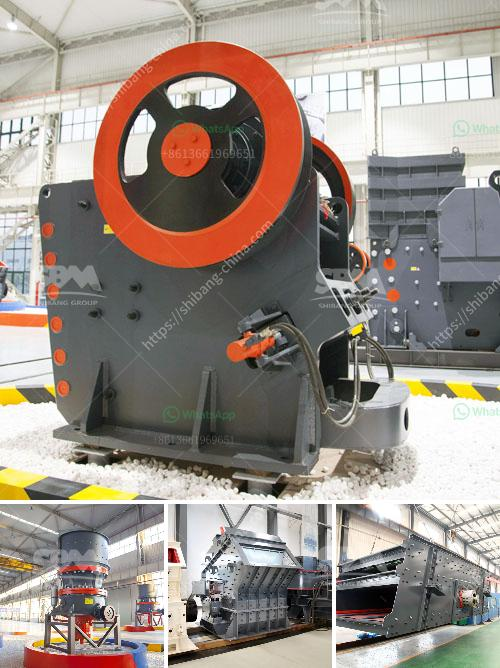

<h3>stone crusher machine china</h3>
Stone Crusher Machine China is a global leader in the production of crushing and screening equipment, grinding mill machinery, mineral processing equipment, and road construction equipment. With over 20 years of experience in the stone crushing machine market, Hongxing Machinery has been targeting the needs of the mining industry, providing customers with top-quality equipment. From coarse crushers such as jaw crushers and cone crushers to impact crushers and VSI sand making machines, all the way down to Raymond mills, ball mills, and agitation tanks, Hongxing Machinery has a wide range of options to suit different customer needs.

China is the largest buyer and consumer of sand and gravel production lines, however, due to high mining costs, environmental protection requirements, and market demand, many manufacturers have turned to small-scale and efficient crushing equipment. Taking the large-scale stone crushing plant with a daily capacity of 600 tons and a production capacity of 5000 tons as an example, the production efficiency is as high as 5000/600 = 8.33 tons per hour.

Hongxing Machinery is a professional stone crushing equipment manufacturer in China. Our machines are widely used in industries such as mining, smelting, building materials, highways, railways, water conservancy, and chemical industry, etc. They are especially suitable for crushing various materials with compressive strength up to 320 MPa. In addition, Hongxing Machinery has also developed an upgraded version of the traditional jaw crusher, which can be used for coarse crushing, medium crushing or fine crushing of different materials, so as to meet the specific requirements of customers.

In recent years, China's economic growth has been driven by infrastructure construction, which in turn has driven the demand for stone crushers. As a result, the stone crushing equipment market is expected to grow at a CAGR of over 9% from 2019 to 2025. The increasing number of high-rise buildings, highways, railway projects, and airports are expected to boost the demand for stone crushing equipment in China and around the world.

China's stone crushing industry plays an important role in the economy and it is an important pillar industry for economic development. With the acceleration of urbanization process, the demand for stone crushing machinery is also growing. Experts predict that the development prospects of China's stone crushing machinery industry will continue to be promising in the future.

To meet the market demand, Hongxing Machinery is constantly improving its equipment technology and actively expanding its production capacity. By adopting advanced design concepts and technologies, the company has developed a series of efficient and energy-saving crushing and grinding machines that can save a considerable amount of energy consumption. At the same time, the company has also invested in research and development to improve the performance and reliability of its equipment.

In summary, stone crusher machine China has the characteristics of high crushing efficiency, high output, low energy consumption, and long service life. It can process materials from various ores, and is suitable for the processing of various brittle materials. With the continuous development of China's economic construction, the development prospects of the stone crushing industry are also very broad. Hongxing Machinery will continue to innovate and improve its equipment technology, and make greater contributions to the development of China's stone crushing machinery industry.
<h3>Contact us</h3><ul><li><strong>Whatsapp:&nbsp;<a href="https://wa.me/8613661969651">+8613661969651</a></strong></li><li><a href="https://swt.shibang-china.com/?git&amp;zhl&amp;stone crusher machine china"><strong>Online Service(chat now)</strong></a></li></ul><h3>Related</h3><ul><li><a href='graphite powder processing equipment.md'>graphite powder processing equipment</a></li><li><a href='bauxite crushing machine in maharashtra.md'>bauxite crushing machine in maharashtra</a></li><li><a href='feldspar crusher supplier.md'>feldspar crusher supplier</a></li><li><a href='cost of the plant capacity of crusher.md'>cost of the plant capacity of crusher</a></li><li><a href='silica sand processing plant flowchart.md'>silica sand processing plant flowchart</a></li></ul>