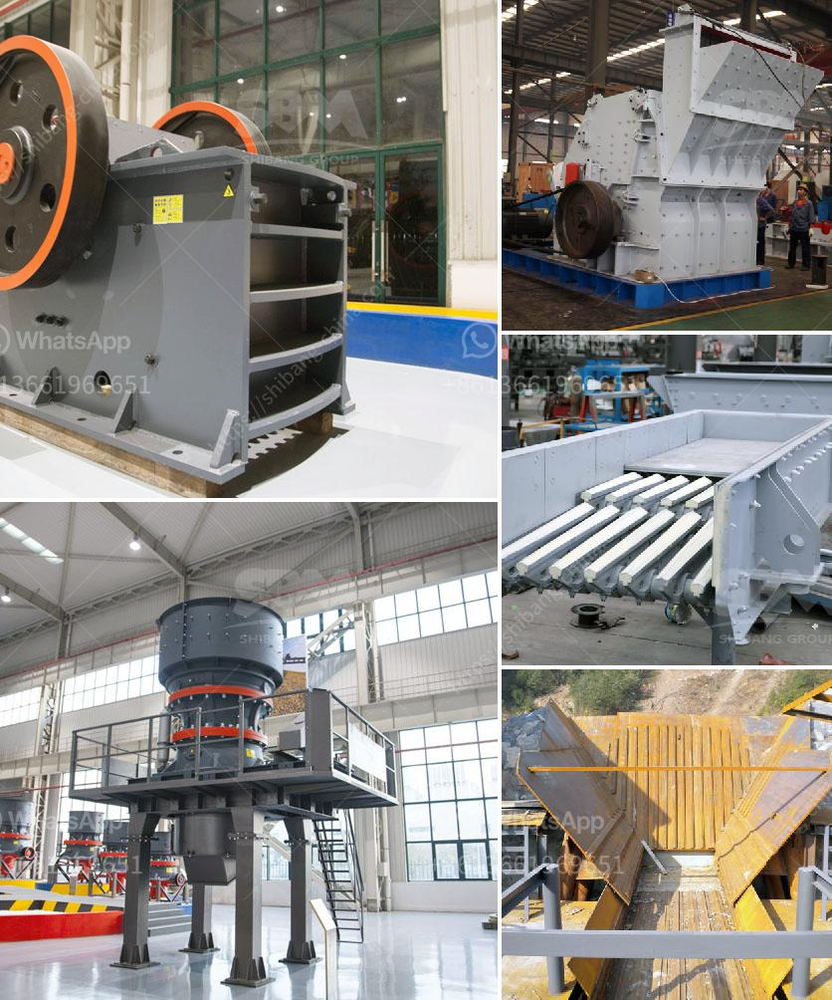

<h3>stone crusher machine for rent in kenya</h3>
Stone crusher machine for rent in Kenya brings in a number of benefits. It makes construction easier, saves time, and is cost-effective too. Most potential clients are initially concerned about the cost of renting a crusher machine, however, this should not be the case. With the increasing demand for construction materials in Kenya, the renting of these machines has become a popular option. 

Renting a stone crusher machine in Kenya offers a solution to save money and still allow contractors to efficiently complete projects. Power requirements, space restrictions, and safety concerns all affect how crusher machines perform. What’s more, many small-scale construction projects in Kenya, such as road and highway projects, can benefit from renting stone crusher machines rather than purchasing them outright. 

Renting a crusher machine provides numerous advantages, such as reducing installation costs and minimizing operational costs. Unlike purchasing new equipment, renting a stone crusher machine ensures that the equipment is regularly maintained, reducing the chances of breakdowns and unexpected downtime. Renting also eliminates the need to invest a large amount of capital upfront, allowing construction companies to allocate their resources more effectively.

Furthermore, renting a stone crusher machine enables operators to achieve greater versatility in their projects. With the option to choose different sizes and types of crushers, operators can select the most suitable machine for specific project requirements. This flexibility maximizes productivity and efficiency, as different projects may require different specifications.

Overall, stone crusher machine rentals provide a cost-effective solution for contractors who require a reliable and efficient machine on a temporary basis. With the increasing popularity of renting equipment in Kenya, more construction companies are realizing the benefits of leasing rather than buying. By renting, contractors can complete projects effectively while minimizing costs and maximizing productivity. 

In conclusion, the availability of stone crusher machines for rent in Kenya has added significantly to the construction industry. It is saving time and money for the contractors. Renting a stone crusher machine is a perfect decision when you need a machine temporarily, and it makes more sense for small-scale projects.
<h3>Contact us</h3><ul><li><strong>Whatsapp:&nbsp;<a href="https://wa.me/8613661969651">+8613661969651</a></strong></li><li><a href="https://swt.shibang-china.com/?git&amp;zhl&amp;stone crusher machine for rent in kenya"><strong>Online Service(chat now)</strong></a></li></ul><h3>Related</h3><ul><li><a href='different part of barite and bentonite mill.md'>different part of barite and bentonite mill</a></li><li><a href='business plan for a cement plant.md'>business plan for a cement plant</a></li><li><a href='small used jaw crusher ebay.md'>small used jaw crusher ebay</a></li><li><a href='cement clinker processing plant.md'>cement clinker processing plant</a></li><li><a href='clinker grinding unit.md'>clinker grinding unit</a></li></ul>