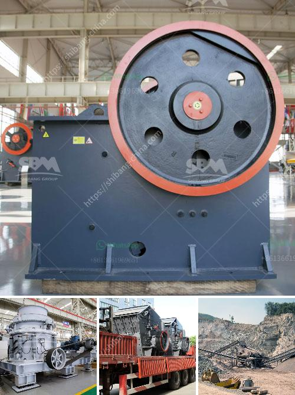

<h3>stone crusher machine for rent or lease india</h3>
India is a country located in southern Asia that is renowned for its scenic beauty, vibrant culture, and ancient heritage. India has a plethora of historically and culturally significant attractions that draw tourists from all over the world. These attractions are spread across various states and regions, making it essential for travelers to rent a car to explore them comfortably.

When it comes to renting a car in India, there are several options available in terms of the type and size of the vehicle. However, if you are looking to rent a stone crusher machine for a demolition or building project, how do you decide which one is best for your needs?

You might want to consider looking for a stone crusher machine for rent or lease if you find yourself in need of a temporary replacement due to a construction project or unforeseen circumstances. Additionally, renting a stone crusher machine allows you to enjoy greater flexibility and versatility, as you can be assured that your stone crushing equipment is always in top condition.

Whether you need a crusher for a day, a week, a month, or a longer-term project, you can easily rent or lease a stone crusher machine from reputable companies in the industry. This is essential because choosing the right machine can greatly impact your project's duration and cost.

One such solution is utilizing a stone crusher machine from a reputable manufacturer like Torsa Machines Limited. It is one of the renowned names in the machinery industry, known for its superior quality machines and exceptional after-sales service. Torsa Machines Limited offers a reliable range of stone crushers for rent or lease in various regions of India.

The stone crushers have different models and sizes, and their specifications can be used as a reference for customers' selection. Indian customers can choose suitable crushing equipment according to their needs. Users can customize the size and output requirements of the equipment according to their budget and requirements.

Renting or leasing a stone crusher machine is a great option for the cost-conscious construction companies, especially if they are in temporary expansion mode. Depending on your requirements, you can choose from a variety of models and sizes of stone crushers, and rent your ideal machine with ease.

Renting or leasing a stone crusher machine also provides flexibility, as you can ensure that your crushing equipment is always in good condition, maximizing reliability and equipment uptime. In such cases, renting equipment is a cost-effective and time-saving solution that provides convenience and ensures a smooth operation on your project site.

In conclusion, stone crusher machines are essential equipment in mining and construction industries. Renting or leasing a stone crusher machine depends on the requirements of the project and the budget. With a reputable manufacturer like Torsa Machines Limited, India has abundant models and sizes of stone crushers available for rent or lease. Contact Torsa Machines Limited today to know more about their stone crusher machines and their availability for rent or lease in India.
<h3>Contact us</h3><ul><li><strong>Whatsapp:&nbsp;<a href="https://wa.me/8613661969651">+8613661969651</a></strong></li><li><a href="https://swt.shibang-china.com/?git&amp;zhl&amp;stone crusher machine for rent or lease india"><strong>Online Service(chat now)</strong></a></li></ul><h3>Related</h3><ul><li><a href='hammer grinder mill.md'>hammer grinder mill</a></li><li><a href='stationary crushers and screens.md'>stationary crushers and screens</a></li><li><a href='iron ore mines cost structure.md'>iron ore mines cost structure</a></li><li><a href='companies that sell conveyor belts.md'>companies that sell conveyor belts</a></li><li><a href='sand screeding machine prices.md'>sand screeding machine prices</a></li></ul>