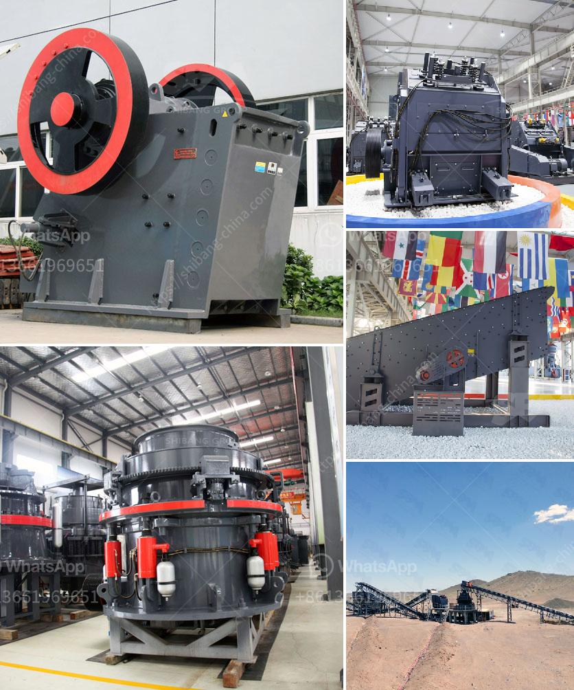

<h3>stone crusher machine from japan</h3>
Japan is one of the leading countries in manufacturing stone crushing machines. It is known for its high-quality craftsmanship and excellent durability. The stone crusher machines in Japan are made up of metal surfaces that are capable of compressing large stones into smaller ones and even into fine powder particles.

Japan, being a technologically advanced country with a developed economy, prioritizes research and development activities. In these manufacturing plants, machines are designed and produced. Customization is also possible based on customer preferences and specific requirements.

One of the main features of stone crushing machines is their compact size. These machines are ideal for use in narrow spaces such as in tunnels and underground mines. They are also commonly used in construction sites to break down large stones into smaller pieces for further processing or for use as aggregates in the production of concrete.

The machines are typically equipped with a powerful diesel engine that generates enough power to drive the crushing mechanism. Some machines may also be equipped with electric motors, depending on the specific requirements of the customers. This allows for a reliable and consistent power supply, ensuring efficient operation of the machine.

The stone crushing machines from Japan are made of high-quality materials that guarantee excellent efficiency, durability, and longevity. Some of the machines are built specifically to maximize productivity in certain types of applications, ensuring optimal performance and reduced downtime.

In addition to their superior quality, these machines are also known for their user-friendly operation. Most machines are equipped with easy-to-use controls and intuitive interfaces, allowing operators to quickly understand and operate the machine without any specialized training.

Another key feature of the stone crusher machines from Japan is their excellent safety mechanisms. These machines are designed to minimize the risk of accidents and injuries to the operators. Safety features such as emergency stop buttons, protective barriers, and safety sensors are incorporated into the machines to ensure safe operation.

Furthermore, the stone crushing machines from Japan are known for their low maintenance requirements. Regular servicing and maintenance are necessary to ensure the smooth functioning of the machines. However, the machines are designed in such a way that routine maintenance tasks can be easily performed, minimizing downtime and ensuring higher productivity.

The stone crusher machines from Japan have been exported to many countries around the world. In fact, Japan is one of the primary markets for stone crushing machines, and thus, there is high demand for these products.

To conclude, Japan is a technologically advanced country that manufactures sophisticated stone crushing machines. These machines are known for their high-quality craftsmanship, excellent durability, and user-friendly operation. With their compact size and powerful engines, they are ideal for various applications, ensuring efficient and reliable performance. Their safety features and low maintenance requirements further contribute to their popularity in the global market.
<h3>Contact us</h3><ul><li><strong>Whatsapp:&nbsp;<a href="https://wa.me/8613661969651">+8613661969651</a></strong></li><li><a href="https://swt.shibang-china.com/?git&amp;zhl&amp;stone crusher machine from japan"><strong>Online Service(chat now)</strong></a></li></ul><h3>Related</h3><ul><li><a href='accessories for conveyor belts.md'>accessories for conveyor belts</a></li><li><a href='grinding mills ata.md'>grinding mills ata</a></li><li><a href='model of raymound roller mill.md'>model of raymound roller mill</a></li><li><a href='gypsum grinding machine plant.md'>gypsum grinding machine plant</a></li><li><a href='rubble crushers for sale.md'>rubble crushers for sale</a></li></ul>