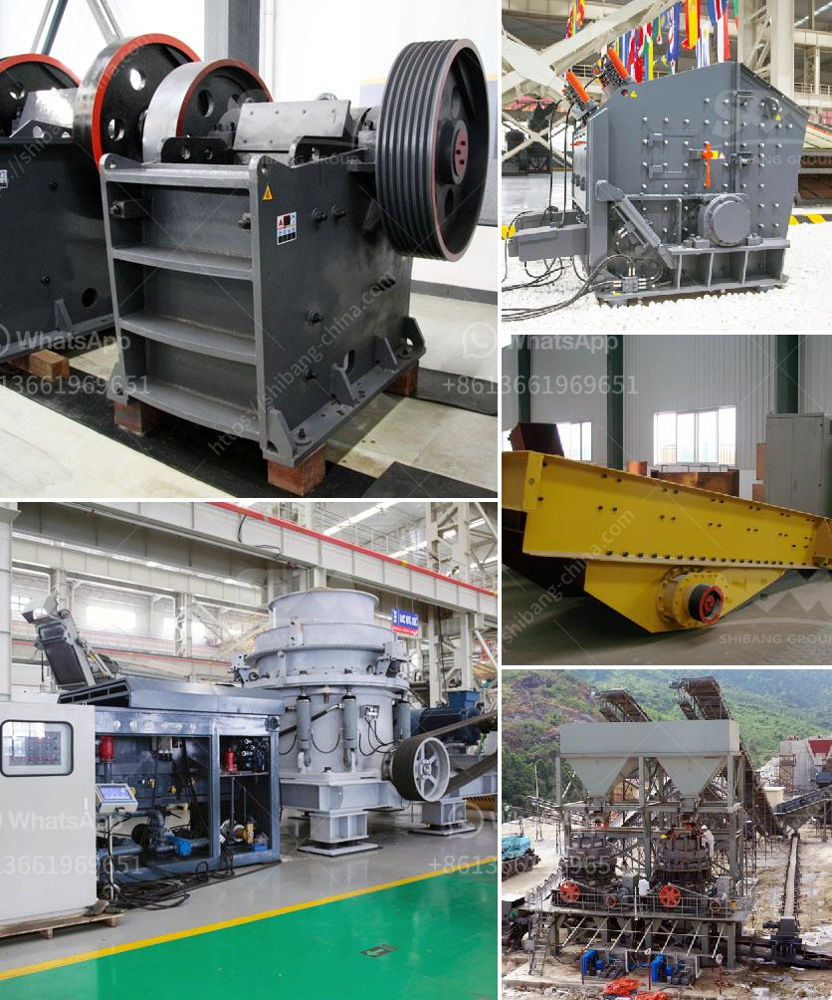

<h3>stone crusher machine manufacturer in ethiopia</h3>
As a professional stone crusher machine manufacturer and exporter, Aimix’s aggregate crusher for sale and other related crusher equipment has been sold to more than 30 countries. In addition, our experts are still researching and designing more advanced machines to meet customers’ demands. All of our aggregate screening plants?are know for their reliable state. aggregate jaw crusheris mainly used for the stage of coarse crushing; the aggregate cone crusher mainly for medium and fine crushing; the aggregate impact crusher also mainly for medium and fine crushing. In addition, for Philippines market, the popular aggregate crusher sale includes jaw crusher machine, cone crusher machine and impact crusher machine.

We have models of stone crushers for sale also. PE jaw crusher, PF impact crusher, HPT cone crusher and roller crusher, etc.

As the leading stone crusher machine manufacturer in China, our company has over 30 years of experience in research, production and sales of stone crusher machine. With strict quality control systems and attention to detail, our qualified engineers are capable of providing our customers with highly efficient and durable stone crushing equipment. Therefore, our company stands out from the competition as it is well-known for its professionalism, reliability and customer satisfaction.

In addition, we have a complete production line which can provide users with advanced technology and equipment, thus ensuring that customers can purchase high-quality products at reasonable prices. We also provide considerate after-sales service to ensure that our customers receive the best support.

In Ethiopia, coordinated efforts have been made by the Ethiopian government and international organizations such as UNICEF to tackle child labor in the country. The Ethiopian government has introduced a series of laws that prohibit child labor and promote the rights of children. Additionally, international organizations have provided support to improve access to education and provide vocational training for children.

Child labor in Ethiopia is a complex issue that requires a multi-dimensional approach. While efforts have been made to address the root causes of child labor, such as poverty and lack of access to education, there is still a long way to go. Collaboration between the government, civil society, and international organizations is crucial in order to create lasting solutions and ensure the well-being of Ethiopian children.

In conclusion, the stone crusher machine manufacturer in Ethiopia plays a crucial role in the construction industry and provides reliable and efficient solutions for the complex process of stone crushing. The availability of strong warranties, efficient aftersales services, and prompt technical support has helped the company build a strong reputation among its customers. With the continuing growth of the construction industry in Ethiopia, the demand for stone crushers will continue to rise, making it a promising business opportunity for the years to come.
<h3>Contact us</h3><ul><li><strong>Whatsapp:&nbsp;<a href="https://wa.me/8613661969651">+8613661969651</a></strong></li><li><a href="https://swt.shibang-china.com/?git&amp;zhl&amp;stone crusher machine manufacturer in ethiopia"><strong>Online Service(chat now)</strong></a></li></ul><h3>Related</h3><ul><li><a href='iron ore beneficiation plant consultants in india.md'>iron ore beneficiation plant consultants in india</a></li><li><a href='indonesia crushers of how much price.md'>indonesia crushers of how much price</a></li><li><a href='quote for sand making machine.md'>quote for sand making machine</a></li><li><a href='cara kerja mesin pemecah batu stone crusher.md'>cara kerja mesin pemecah batu stone crusher</a></li><li><a href='stone crusher hyderabad.md'>stone crusher hyderabad</a></li></ul>