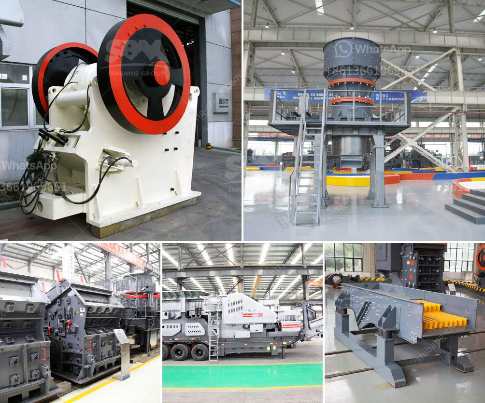

<h3>stone crusher made in malaysia</h3>
Stone crusher in Malaysia is manufactured from Shanghai Xuanshi,It is the main mineral processing solutions. XSM stone crushing machine project-stone crusher in malaysia. ShangHai XSM (stone crusher in malaysia) are a professional production of stone crushing machine.Sales and Widely used in Europe, South America, Africa, East Asia and Asia region.

Stone Crusher Supplier In Malaysia - XSM. Stone Crusher Supplier In Malaysia. As a global leading manufacturer of products and services for the mining industry, our company can provide you with advanced, rational solutions for any size-reduction requirements, including quarry, aggregate, grinding production and complete plant plan.

If you are interested in our products, please contact us freely. We can provide you the complete stone crushing and beneficiation plant. Also supply stand-alone crushers, mills and beneficiation machines as well as their spare parts.Working Principle of stone crusher in malaysia. First, the raw materials are regularly conveyed into the elementary-crushing machine by the vibrating feeder, then the belt conveyor transfers the elementary products to impact crusher for secondary crush. The secondary products will be separated according to its size by the vibrating screen.

The products not matching needs will be returned to the impact crusher for further crushing. Over size materials go back to the sand making machine and form a closed circuit cycle. The sizes of final products will be graded and separated according to customers' requirements, and the deduster will be attached for the sake of environment protection.Stone crusher in malaysia has beautiful structure and widely used in construction field, village renovation in the countryside, mountain paths, roads and other projects. Stone crusher in malaysia has various types, such as jaw crusher, impact crusher and cone crusher.

Depending on the different application requirements, the stone crusher in malaysia is also widely used in different industries, such as mining, metallurgy, building materials, highways, railways, water conservancy and chemical industries, etc. These industries have a huge demand for stone crusher in malaysia.The stone crusher in malaysia is suitable for crushing various medium-hard and above materials, such as granite, iron ore, basalt, limestone, quartzite and sandstone. These materials are widely used in construction, metallurgy, highways, railways, industries and require various types of equipment.

The stone crusher in malaysia produced by our company has excellent performance, reasonable price and considerate after-sales service. This kind of stone crusher, jaw crusher, impact crusher, cone crusher, sand making machine and others, has stable performance, cost-effective and become more and more popular in construction field and many other industries.If you are interested in our products, please contact us freely. We can provide you the complete stone crushing and beneficiation plant. Also supply stand-alone crushers, mills and beneficiation machines as well as their spare parts.
<h3>Contact us</h3><ul><li><strong>Whatsapp:&nbsp;<a href="https://wa.me/8613661969651">+8613661969651</a></strong></li><li><a href="https://swt.shibang-china.com/?git&amp;zhl&amp;stone crusher made in malaysia"><strong>Online Service(chat now)</strong></a></li></ul><h3>Related</h3><ul><li><a href='stone sand making machine in nignia.md'>stone sand making machine in nignia</a></li><li><a href='proppant sand crusher manufacturing process.md'>proppant sand crusher manufacturing process</a></li><li><a href='crusher in malaysia.md'>crusher in malaysia</a></li><li><a href='vibrating screens kenya.md'>vibrating screens kenya</a></li><li><a href='diatomite grinding mill in indonesia.md'>diatomite grinding mill in indonesia</a></li></ul>