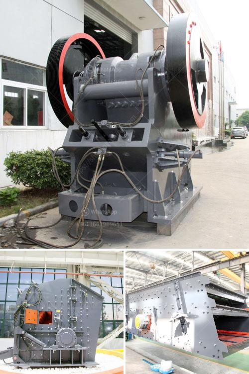

<h3>stone crusher manufacturers in dhansura</h3>
Stone crusher manufacturers in Dhansura are mainly located in the aravalli range among the various cities and towns in Gujarat. There are several crushing machines such as jaw crusher, cone crusher, impact crusher and so on. They are used for crushing various minerals and rocks as well as processing construction waste and materials such as granite, limestone, basalt, shale, river stone, bluestone, sandstone, calcium carbide, iron ore, copper ore, steel slag, etc. They are widely used in mining, building materials, metallurgy, chemical, environmental protection and other industries.

The stone crusher manufacturers in Dhansura offer their products with high quality and affordable prices. For instance, the crushers are used for crushing stones and hard rocks fed into it. They are highly efficient and can be easily transported. Hydraulic breakers are used for demolishing hard structures and can be easily controlled. Hydraulic crushers are designed for the secondary demolition of concrete and metal structures.

The stone crusher manufacturers in Dhansura also supply their products to various construction projects. The variety of products for different construction needs are managed by a team of professionals. They understand the pulse of the market and provide products according to the consumers' needs. The construction projects include building roads, bridges, buildings, and other infrastructure. In such projects, stone crushers play a crucial role in reducing the size of rocks and stones for construction purposes.

The stone crusher manufacturers in Dhansura specialize in producing various types of crushers, such as jaw crushers, impact crushers, cone crushers, vertical shaft impact crushers, hammer mills, vibrating screens, vibrating feeders, sand crushers, mobile crushers, etc. These crushers are widely used in heavy engineering industries for various crushing applications. These crushers are widely used in the mining industry, wherein mined ores are crushed into smaller pieces for further processing.

In conclusion, the stone crusher manufacturers in Dhansura ensure that their products are manufactured using high-quality materials and advanced technology. Their products are highly praised in the market for their durability, efficiency, and sturdiness. The stone crusher manufacturers in Dhansura also provide timely after-sales support for their products. With an emphasis on constant innovation and improvement, the stone crusher manufacturers in Dhansura continue to serve the market with their products tailored to meet the demands of the construction industry.
<h3>Contact us</h3><ul><li><strong>Whatsapp:&nbsp;<a href="https://wa.me/8613661969651">+8613661969651</a></strong></li><li><a href="https://swt.shibang-china.com/?git&amp;zhl&amp;stone crusher manufacturers in dhansura"><strong>Online Service(chat now)</strong></a></li></ul><h3>Related</h3><ul><li><a href='primary impact crusher disadvantages.md'>primary impact crusher disadvantages</a></li><li><a href='advance stone agregate crusher equipments.md'>advance stone agregate crusher equipments</a></li><li><a href='functions of a mobile crushing plant.md'>functions of a mobile crushing plant</a></li><li><a href='brick making machine for sale in south africa.md'>brick making machine for sale in south africa</a></li><li><a href='turnkey project for gypsum board manufacturing plant.md'>turnkey project for gypsum board manufacturing plant</a></li></ul>