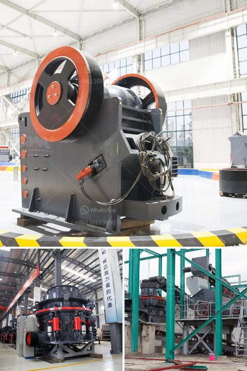

<h3>stone crusher mobile plant di indonesia</h3>
Stone crusher mobile plant di Indonesia is a specialized equipment used for crushing stones, stones will be crushed into smaller size and used in the road and building construction industry. As a leading stone crusher manufacturer in Indonesia, we supply various types of stone crushers for sale, such as jaw crusher, impact crusher, cone crusher, mobile crusher and hammer crusher.

We provide comprehensive range of stone crushing machine for sale including jaw crusher, impact crusher, cone crusher, hammer crusher, VSI crusher, roller crusher and screen.

The mobile stone crusher machine enables us to provide excellent performance and flexibility. With many years of stone crushing experience in the industry, we have been able to provide customers with high-quality and reliable products and solutions. Our stone crusher machines have been exported to over 50 countries worldwide, including Indonesia.

The mobile stone crusher plant is a valuable piece of equipment for any construction site. It has the ability to crush rocks into smaller pieces of usable aggregate material. Whether you need to refine gravel, crush rocks, or sand, you can use a mobile stone crusher machine to do it quickly and efficiently.

The craft and production of the mobile stone crusher plant are not only the key factors to the quality and output of the equipment but also related to the safety and environmental protection of the production process. Therefore, when choosing a mobile stone crusher plant, customers should not only consider the quality and performance of the equipment but also its environmental protection features.

In addition, we also focus on the after-sales service, offering reliable technical support and maintenance services for the stone crusher mobile plant di Indonesia. Our service team has a wealth of experience and can provide timely and effective technical support to ensure the smooth operation of our customers' stone crusher plants.

The stone crusher mobile plant di Indonesia is designed to crush hard rock and any recycling materials equally effectively. In addition, the screen allows the equipment to screen the crushed materials into the desired, clean end products, meeting the strictest application requirements.

Featuring the tips and tricks for efficient use of the machine, our mobile stone crusher plant is carefully optimized for high crushing performance and low operating costs. It offers high flexibility and low wear costs, are suitable for various applications, from limestone to taconite and from rock quarries to ore mining.

To summarize, the stone crusher mobile plant di Indonesia is a versatile equipment that provides advanced technologies for stone crushing applications. It enables quick and easy to transport around the working site. Moreover, it offers high flexibility and low operational costs for the mining and construction industry. We are confident that our mobile stone crusher plant will provide you with a cost-effective solution for your stone crushing needs.
<h3>Contact us</h3><ul><li><strong>Whatsapp:&nbsp;<a href="https://wa.me/8613661969651">+8613661969651</a></strong></li><li><a href="https://swt.shibang-china.com/?git&amp;zhl&amp;stone crusher mobile plant di indonesia"><strong>Online Service(chat now)</strong></a></li></ul><h3>Related</h3><ul><li><a href='rock crusher pulverizer.md'>rock crusher pulverizer</a></li><li><a href='south korean mobile crusher.md'>south korean mobile crusher</a></li><li><a href='stone crusher machine from japan.md'>stone crusher machine from japan</a></li><li><a href='mobile crushing plants usa.md'>mobile crushing plants usa</a></li><li><a href='coal crusher machine in zhengzhou henan china.md'>coal crusher machine in zhengzhou henan china</a></li></ul>