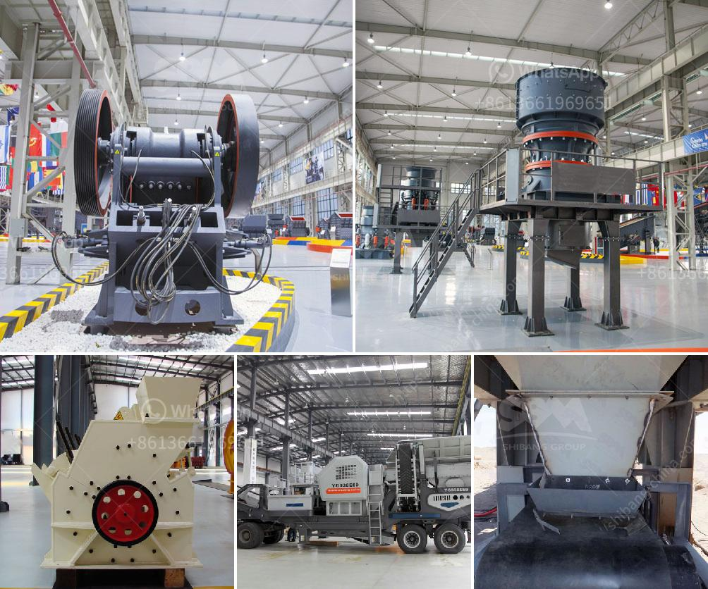

<h3>stone crusher pe 250x400</h3>
The stone crusher pe 250x400 is a valuable piece of equipment for any construction site. With the ability to crush and process a wide range of materials, this versatile tool can aid in any project - big or small. This little powerhouse is perfect for those hard-to-reach areas, making it the ideal choice when it comes to excavating and working with tough materials.

One of the standout features of the pe 250x400 stone crusher is its ability to break down and crush larger rocks into more manageable sizes. This makes it an indispensable tool for construction sites where large rocks may need to be broken down before they can be transported or used for other purposes. With its robust design and powerful engine, this stone crusher can handle even the toughest of materials.

The pe 250x400 stone crusher is not only useful for excavating projects, but it can also be used in a variety of applications. It can be utilized to crush materials such as concrete, asphalt, and stone into smaller, more manageable sizes. This makes it perfect for road construction, as it can be used to create a solid foundation for the road surface. It can also be used in the production of building materials, such as aggregates and sand.

One of the main benefits of using the stone crusher pe 250x400 is its portability. Unlike larger crushers that require heavy machinery for transport, this stone crusher can easily be loaded onto a trailer or truck and taken to different locations. This means that it can be used on multiple job sites without the need for additional equipment or resources. Its compact size also allows for easy storage when not in use, making it a practical choice for contractors and construction companies.

In addition to its portability, the pe 250x400 stone crusher is incredibly easy to use. With its simple controls and intuitive design, even novice operators can quickly become proficient in operating this machine. Its powerful engine ensures smooth operation, while its sturdy construction ensures longevity and durability. Maintenance is also hassle-free, with easily accessible parts and components that can be easily replaced or repaired.

Despite its small size, the stone crusher pe 250x400 packs a punch when it comes to performance. It can crush materials at a high rate, ensuring efficient and effective operation. Its compact design also allows for easy maneuverability and access to tight spaces. Whether you need to crush rocks or break down concrete, this stone crusher is up to the task.

In conclusion, the stone crusher pe 250x400 is a versatile and valuable tool for any construction site. Its ability to break down and crush a variety of materials makes it indispensable for any excavation project. Its portability, ease of use, and powerful performance make it a standout choice for contractors and construction companies alike. With the stone crusher pe 250x400, you can conquer any construction project with ease.
<h3>Contact us</h3><ul><li><strong>Whatsapp:&nbsp;<a href="https://wa.me/8613661969651">+8613661969651</a></strong></li><li><a href="https://swt.shibang-china.com/?git&amp;zhl&amp;stone crusher pe 250x400"><strong>Online Service(chat now)</strong></a></li></ul><h3>Related</h3><ul><li><a href='ballast crushers cost.md'>ballast crushers cost</a></li><li><a href='suplier jaw stone crusher nakayama in indonesia.md'>suplier jaw stone crusher nakayama in indonesia</a></li><li><a href='mining equipment chrome concentrates in turkey.md'>mining equipment chrome concentrates in turkey</a></li><li><a href='raymond roller mill model 30 picture.md'>raymond roller mill model 30 picture</a></li><li><a href='jaw crusher in kenya.md'>jaw crusher in kenya</a></li></ul>