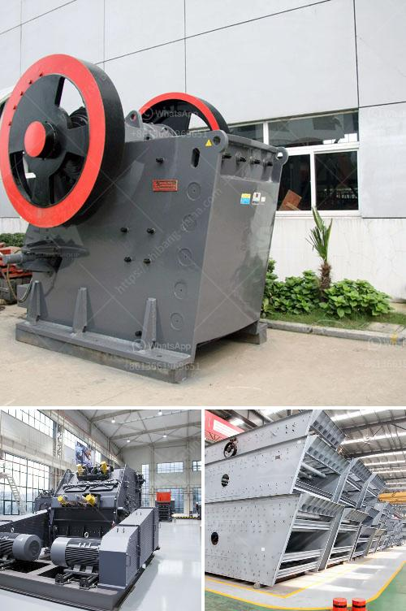

<h3>stone crusher plant cost</h3>
Stone crusher plant cost is a crucial factor in ensuring the profitability of a crushing operation. Let’s consider an example of a 100 tph stone crushing plant to demonstrate this.

As per a manufacturer, the total cost of a 100 tph stone crushing plant is Rs. 75,00,000, including the machinery, investment, raw materials, labor, and transportation costs, among others.

This 100 tph stone crushing plant is suitable for small scale production line. It can be used to crush Granite, Gypsum, Limestone, River stone, Pebble, Gravel, Basalt, Ore, etc.

The feed size of the plant is less than 500 mm, which is capable of processing aggregates in gravel, cement, and concrete industries. The crushing plant is equipped with a vibrating feeder, a jaw crusher with an 800 mm x 3000 mm dimension, a vibrant screening separate platform, and a belt conveyor.

Using these machines, the plant processes the rocks to produce smaller-sized aggregates for various construction projects. In addition to the primary crusher, the plant also has secondary and tertiary crushers, which further breakdown the stones into even smaller sizes.

Apart from the machinery cost, the production cost of the stone crusher plant is also relevant. To calculate the overall operating cost of the crusher plant, monthly operational expenses like electricity, staff wages, maintenance costs, overhauling costs, insurance expenses, and administrative costs need to be considered. Usually, these costs amount to around 30-40% of the overall plant cost.

While choosing the location for the plant, factors like the availability of raw materials, proximity to markets, and transportation facilities should be given substantial importance. This will help minimize costs associated with the procurement of raw materials and transport of finished products.

Additionally, proper management of working capital is crucial for a successful stone crushing plant. Managing inventory levels and monitoring cash flow are practices that can help minimize costs.

Considering all these factors, it is crucial to conduct a cost analysis before establishing the stone crushing plant. This will help determine the feasibility of the project and provide a clear understanding of the investment required for the plant.

Moreover, it is essential to conduct a market analysis to determine the demand for crushed stones in the region. Identifying potential customers and studying the competition will help in devising marketing strategies to maximize revenue.

In conclusion, the stone crusher plant cost is determined by various factors like the capacity, transport, labor, machinery, and the location of the plant, which may add up to the overall cost. Therefore, a cost-analysis is suggested prior to establishing a stone crushing plant.
<h3>Contact us</h3><ul><li><strong>Whatsapp:&nbsp;<a href="https://wa.me/8613661969651">+8613661969651</a></strong></li><li><a href="https://swt.shibang-china.com/?git&amp;zhl&amp;stone crusher plant cost"><strong>Online Service(chat now)</strong></a></li></ul><h3>Related</h3><ul><li><a href='gold mining equipment companies in china.md'>gold mining equipment companies in china</a></li><li><a href='calculation of torque of hammer mill.md'>calculation of torque of hammer mill</a></li><li><a href='copper ore concentration processing.md'>copper ore concentration processing</a></li><li><a href='second hand quarry equipment price philippines.md'>second hand quarry equipment price philippines</a></li><li><a href='high gradient separator in zhengzhou.md'>high gradient separator in zhengzhou</a></li></ul>