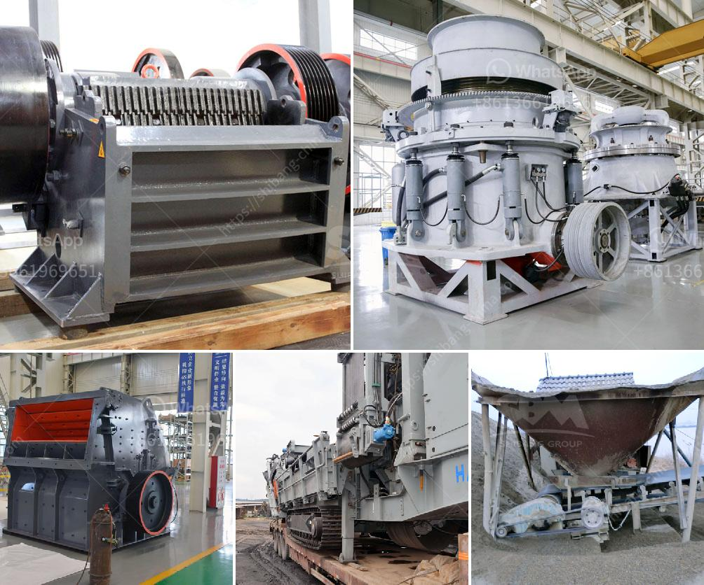

<h3>stone crusher plant in ghana</h3>
Stone crusher plant, also known as stone crushing plant, is the ideal equipment for producing various aggregates, such as coarse crushed stone, fine crushed stone, sand, and gravel for construction and highway projects. It can process granite, basalt, limestone, etc., and has a wide range of applications in the construction industry.

The stone crusher plant in Ghana is mainly used for crushing stones of various sizes into construction aggregates for building, highway, railway, and other projects. It has been widely applied in Ghana's ore mining industry, and has been highly praised by customers from all over the world.

The stone crusher plant is designed with the vibrating feeder, jaw crusher, cone crusher, vibrating screen, belt conveyor and electric control panel. It has a high degree of automation, and can be operated by a single person remotely. The whole production line is compact in structure, stable in operation, and easy to install and maintain.

In addition, the stone crusher plant in Ghana is easy to operate and maintain, ensuring the production efficiency and reducing the downtime. Users can choose different types of crushers according to their specific needs, and the production capacity of the plant can also be adjusted to meet the different requirements of customers.

Furthermore, the stone crusher plant in Ghana is environmentally friendly, as it produces low noise and less dust. The stone crusher plant has a strong sealing performance, which effectively reduces dust pollution, and ensures the cleanliness of the surrounding environment.

Overall, the stone crusher plant in Ghana has a good market prospect and is very popular in the construction industry. With the continuous development of infrastructure construction in Ghana, the demand for sand, gravel, and crushed stones will continue to increase, which provides a favorable opportunity for the development of the stone crusher plant in Ghana.
<h3>Contact us</h3><ul><li><strong>Whatsapp:&nbsp;<a href="https://wa.me/8613661969651">+8613661969651</a></strong></li><li><a href="https://swt.shibang-china.com/?git&amp;zhl&amp;stone crusher plant in ghana"><strong>Online Service(chat now)</strong></a></li></ul><h3>Related</h3><ul><li><a href='cost new jaw crusher.md'>cost new jaw crusher</a></li><li><a href='ball mill servicing agents south africa.md'>ball mill servicing agents south africa</a></li><li><a href='hydraulic roll crusher zenith.md'>hydraulic roll crusher zenith</a></li><li><a href='mobile crusher 70 ton.md'>mobile crusher 70 ton</a></li><li><a href='vibrating screens kenya.md'>vibrating screens kenya</a></li></ul>