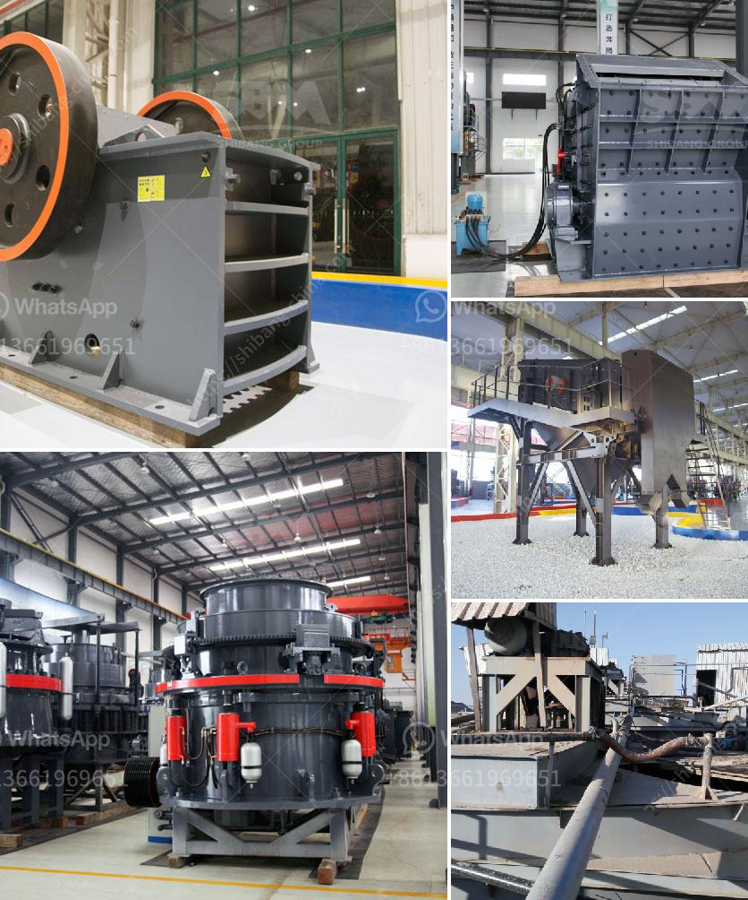

<h3>stone crusher plant kapasitas 60 ton h</h3>
Stone crusher plant, whose design production capacity is 50-800T/H is mainly composed of vibrator feeder, jaw crusher, impact crusher, vibrating screen, belt conveyor, centralized electronic control and other equipment. Configuration of cone crusher and dust-cleaning apparatus is necessary to satisfy customers' different needs.

Stone crusher plant can crush limestone, granite, basalt and so on to product aggregates for ready mix concrete, building material, construction site and others. Various final product sizes are available with customizing crushing plant system solution.

The stone crushing plant has versatile application such as iron ore crushing plant, gold ore crusher plant, bauxite crushing plant, copper beneficial plant, nickel mining plant, manganese crushing plant, limestone crushing plant, feldspar crushing plant and so on.

This crushing plant is widely used as sand making line, rock crushing line, stone crushing plant, ore dressing line, aggregate production line, construction waste recycling plant and so on.

For the contractors and final users, SBM Company has designed complete stationary, portable, mobile crushing plants. The jaw & cone crushing plant of 50 TPH -500 TPH is suitable for crushing bulk materials at a fixed open-pit mine or quarry.

This series stone crushing plant consists of large scale jaw crusher, heavy duty cone crusher, vibrating feeder, vibrating screen, belt conveyor and other auxiliary equipment. Flow chart of stone crushing plant:

SBM has built the complete 500 TPH -600 TPH stone crushing plant in India for producing building materials such as sand and aggregates. This stone crushing plant consist of LC3000X4000 Hopper, ZSW-490×130 Vibrating Feeder, PE-1000×1200 Jaw crusher, GZD-200×120 Vibrating Feeder, CSB240 - Coarse Cone crusher, CSB240 - Medium Cone crusher, Vibrating screen with type 3YA2460 and several belt conveyors.

With this crushing plant, consumers can make use of the line of around 300-500mm. For the material processing, the stone crusher plant for sale from SBM is suitable for crushing various kinds of ores and rocks with the required granularity size of the material. Jaw crusher is usually used as the primary crusher in the crushing plant.

Stone crusher plant kapasitas 60 ton h is mainly composed of vibrator feeder, jaw crusher, impact crusher, vibrating screen, belt conveyor, centralized electronic control and other equipment. Configuration of cone crusher and dust-cleaning apparatus is necessary to satisfy customers' different needs.

The stone crusher plant to crush stones has been sought after and the sales market of the equipment is very good in recent years due to its wide application, new design, high production efficiency, strong capacity and stable operation.

The investment prospect of the stone crusher plant is driven by certain external factors. Let's analyze the investment market of the stone crushing plant.

Graded sand and gravel material requires careful use of aggregate machinery. The type of crusher and crushing process depends on the hardness of the material. Complete crushing process of granite includes three stages, coarse crushing, medium crushing and fine crushing.

What is more, the three crushers can work simultaneously, which can produce 300-500 tons of granite gravels in an hour, making it a highly efficient process.

Stone crusher plant consists of vibrating feeder, jaw crusher, cone crusher, impact crusher, vibrating screen, belt conveyor and electric control panel etc. Its designed throughput generally is 50-600 t/h. In order to meet the different processing needs of customers, it can be equipped with cone crusher, dust removal equipment, etc.

The crushing plant is designed based on the required output size range and crushing capacity. It can crush granite, limestone, basalt, marble, iron ore, river pebbles, construction waste, etc. It's suitable for the materials that need final products with cubic shape and high crushing ratio. The impact crusher is widely used in the crushing of various minerals and rocks with crushing strength less than 320 MPa, including iron ore, copper ore, gold ore, manganese ore, river rock, gravel, granite, basalt, minerals, quartz, diabase, etc.
<h3>Contact us</h3><ul><li><strong>Whatsapp:&nbsp;<a href="https://wa.me/8613661969651">+8613661969651</a></strong></li><li><a href="https://swt.shibang-china.com/?git&amp;zhl&amp;stone crusher plant kapasitas 60 ton h"><strong>Online Service(chat now)</strong></a></li></ul><h3>Related</h3><ul><li><a href='standard operating procedure for cement manufacturing.md'>standard operating procedure for cement manufacturing</a></li><li><a href='cost of feldspar crushing machine pakistan.md'>cost of feldspar crushing machine pakistan</a></li><li><a href='accessories for conveyor belts.md'>accessories for conveyor belts</a></li><li><a href='price of ballast per ton in kenya.md'>price of ballast per ton in kenya</a></li><li><a href='cedar rapids crusher for sale.md'>cedar rapids crusher for sale</a></li></ul>