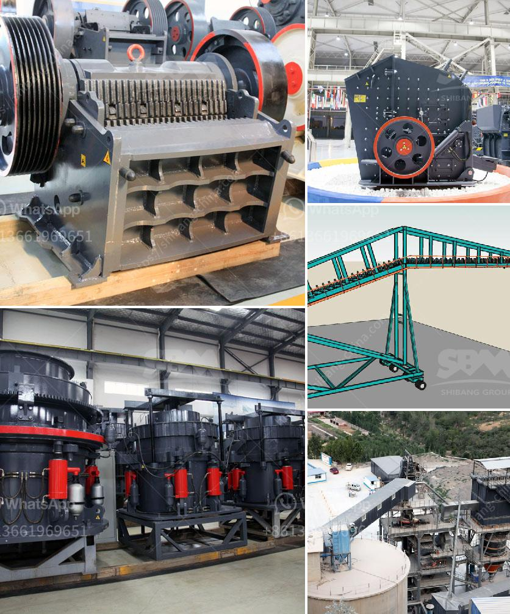

<h3>stone crusher plant management</h3>
Stone crusher plant management is a demanding task, especially for those who own and operate stone crushing plants. To fulfill the needs of their customers and ensure efficiency and productivity, owners and operators often struggle to understand the best ways to run their plants. This blog aims to help such owners and operators by providing insight into the key aspects of plant management.

The operation of a stone crushing plant is highly automated with a large conveyor system, crushing chamber, and screening system. The process of producing such resources can often be complex, with many large pieces of equipment needed to perform various tasks and processes. This requires a high level of organization and coordination to ensure smooth and efficient production.

One of the crucial aspects of stone crusher plant management is the planning and scheduling of maintenance, repair, and servicing. Regular maintenance, including routine inspection of equipment, ensuring the availability of proper tools and spare parts, and conducting maintenance activities according to the manufacturer's guidelines, can significantly reduce the risk of unexpected breakdowns and downtime.

In addition to maintenance, operational factors such as raw material availability, production targets, and quality control play a vital role in plant management. Stone crusher plants must constantly focus on optimizing these factors to ensure effective and efficient operations.

Effective inventory management is another significant aspect of stone crusher plant management. Solid inventory management involves tracking and controlling inventory levels, monitoring consumption rates, and ensuring an adequate supply of raw materials. This helps reduce the risk of production delays and ensures a seamless production process.

Furthermore, effective communication and coordination between different teams and departments within the plant are crucial for its smooth functioning. Regular meetings and discussions will help identify and address any ongoing issues, improve team cooperation, and streamline operations.

In an era of digitalization, incorporating technology and software solutions into stone crusher plant management can provide numerous benefits. There are various software solutions available in the market that offer features such as real-time monitoring of plant operations, tracking of production performance, and generating reports for analysis. Implementing such software can significantly enhance plant management, enabling managers to make data-driven decisions and optimize plant performance.

Lastly, ensuring compliance with environmental regulations and promoting sustainable practices is essential for stone crusher plant management. This includes monitoring and controlling the emission of pollutants, implementing proper waste management systems, and adopting eco-friendly practices in the plant's operations.

In conclusion, effective stone crusher plant management is vital to ensure smooth and efficient production of crushed stones of desired sizes. Plant managers must follow all the necessary steps to ensure efficient operations, incorporating maintenance, inventory management, quality control, and the use of technology. By considering these aspects, owners and operators can optimize their plant's performance, enhance productivity, and meet customer demands while maintaining environmental sustainability.
<h3>Contact us</h3><ul><li><strong>Whatsapp:&nbsp;<a href="https://wa.me/8613661969651">+8613661969651</a></strong></li><li><a href="https://swt.shibang-china.com/?git&amp;zhl&amp;stone crusher plant management"><strong>Online Service(chat now)</strong></a></li></ul><h3>Related</h3><ul><li><a href='conveyor belt capacity ton per hours.md'>conveyor belt capacity ton per hours</a></li><li><a href='limestone crushing and making sand machine.md'>limestone crushing and making sand machine</a></li><li><a href='medium speed trapezium mill.md'>medium speed trapezium mill</a></li><li><a href='quartz ball mill.md'>quartz ball mill</a></li><li><a href='rock crusher pulverizer.md'>rock crusher pulverizer</a></li></ul>