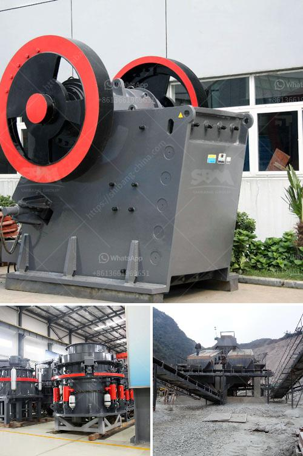

<h3>stone crusher plant</h3>
Stone crusher plants are built in the specified area to mine the raw product which is stone. Since this is a program that runs for a long period if time there are different things that are found in the plant. Electricity passes by to run the machinery or there is a fuel depot if the electricity is not near. This crusher plant is just located within the mountains and contains varying raw material such as Basalt, Chrome, Dolomite, Feldspar, and Granite. While the crushing machinery is electrically driven, it has a differential gearbox for transferring the power to the four large wheels.

This equipment is effective in reducing particle sizes. After being crushed, the smaller materials are sent to the screening equipment for grading. The larger particles are sent back to the crusher for more crushing. The entire plant process includes primary, secondary, and tertiary crushing stages where different varieties of crusher machines are being deployed.

The basic purpose of the crushing process is to liberate minerals so they can be chemically extracted. Companies that specialize in crushing operations have a responsibility to conduct their crushing in a manner that is safe, reasonable, and economical. Crushing plants can generate high volumes of dust due to the nature of the minerals being crushed, the size of the materials being crushed, and the type of operation. Some dust is generated during the crushing process. Therefore, these stone crusher plants are being fenced in a specific area to reduce emissions of dust.

Crushing plants have very different layouts depending on when and for what purpose they were built. Some plants have been designed to be able to crush any type of material, while others are designed to be able to crush specific materials. An operation where the crushing process involves changing the grade or type of raw material means that two different types of crusher will be needed. Depending on the scale of the work, it may be necessary to borrow or rent one that is larger and capable of processing hundreds or thousands of tons a day.

The primary features of a stone crusher plant include its simple design, easy maintenance, and high productivity. However, the whole installation process does not depend solely on the practicality of the machine, as different factors come into play.

A stone crusher plant provides lasting benefits such as reduced overall costs. It is an economic solution for small and medium-sized businesses. Specific materials processing, like aggregates for hollow blocks, flooring and other building materials require different classifications of stone crushers.

Since a stone crusher can be tailored to fit various applications, it is helpful to consider your long-term needs. Listening to your needs, and following through with your requirements, will ensure that it will do the job you have hired the plant to do.

In conclusion, a stone crusher plant is designed for productivity and safety, but is not initially recognized as an important tool for all businesses. However, when you see the wider picture, innovative small businesses will win out in the end.
<h3>Contact us</h3><ul><li><strong>Whatsapp:&nbsp;<a href="https://wa.me/8613661969651">+8613661969651</a></strong></li><li><a href="https://swt.shibang-china.com/?git&amp;zhl&amp;stone crusher plant"><strong>Online Service(chat now)</strong></a></li></ul><h3>Related</h3><ul><li><a href='crusher conveyor philippines.md'>crusher conveyor philippines</a></li><li><a href='copper crusher exporter in south africa.md'>copper crusher exporter in south africa</a></li><li><a href='mobile stone crusher in germany.md'>mobile stone crusher in germany</a></li><li><a href='vibrating screen price philippines.md'>vibrating screen price philippines</a></li><li><a href='used mobile stone crushers for sale.md'>used mobile stone crushers for sale</a></li></ul>