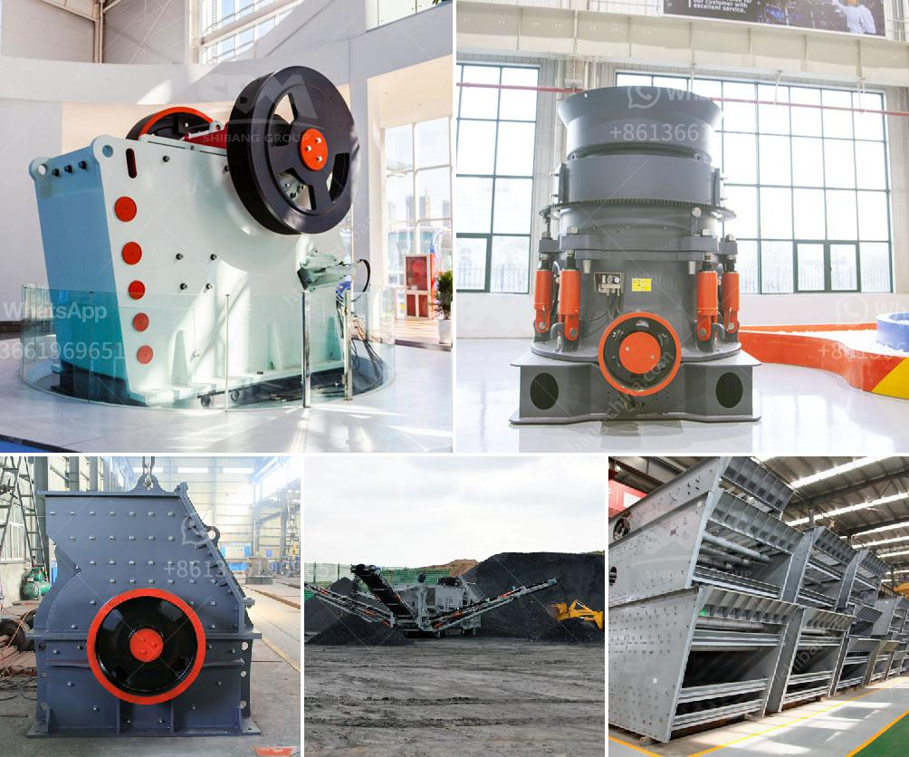

<h3>stone crusher powder which products in use in philippines</h3>
Stone crushing industry is an important industrial sector in the Philippines. The crushed stones are commonly used as raw materials for various construction activities like buildings, roads, bridges, airports, and other infrastructure works. Crushed materials are the raw materials for many quarrying operations. The stone crusher powder, which is related to the stone crushing equipment, is also called the stone crushing material product.

With the rapid development of the Philippines infrastructure construction, the demand for gravel is growing rapidly. However, many people do not understand the fact that not all crusher powders are suitable for users' requirements. In the Philippines, crusher powders are widely used in the construction industry and have a large market demand. However, there are many different types of crusher powders and not all of them are suitable for users' requirements.

Among the various crusher powders available in the Philippines, the stone crusher powder produced by our company is widely used in the construction industry due to its good quality and reliable performance. The stone crusher powder produced by our company can meet the requirements of different users. Our stone crusher powder has many advantages, such as high reliability, good performance, and low price.

Although the stone crusher powder is widely used and can provide economic benefits for users, it is also harmful to human health. The stone crusher powder has a strong chemical reaction and can cause serious irritation to the skin. Therefore, it must be produced and processed in a safe and environmentally friendly environment. To ensure the safety and health of workers, it is necessary to equip the stone crusher powder production line with corresponding safety protection devices.

In recent years, with the continuous progress of science and technology, the technology of stone crusher powder has been greatly improved. Our stone crusher powder production line has been constantly optimized and upgraded. The advanced equipment and processes have greatly improved the crushing efficiency and product quality of the stone crusher powder. At the same time, we have also implemented stronger environmental protection measures to minimize pollution during the production process.

The stone crusher powder produced by our company has a wide range of applications. We have successively provided stone crusher powder to various construction projects in the Philippines, including airports, roads, highways, bridges, etc., and have been well received by customers.

In conclusion, the stone crusher powder produced by our company is widely used in the construction industry due to its good quality and reliable performance. It is an important raw material for many quarrying operations. However, it is necessary to pay attention to the safety and health issues during the production and use of stone crusher powder. With the continuous progress of science and technology, our stone crusher powder production line has been greatly improved, providing customers with high-quality and environmentally friendly products.
<h3>Contact us</h3><ul><li><strong>Whatsapp:&nbsp;<a href="https://wa.me/8613661969651">+8613661969651</a></strong></li><li><a href="https://swt.shibang-china.com/?git&amp;zhl&amp;stone crusher powder which products in use in philippines"><strong>Online Service(chat now)</strong></a></li></ul><h3>Related</h3><ul><li><a href='size and capasity typical jaw crusher.md'>size and capasity typical jaw crusher</a></li><li><a href='list of crusher industry in nepal.md'>list of crusher industry in nepal</a></li><li><a href='ball mills china.md'>ball mills china</a></li><li><a href='hammer mill grinder for sale in dubai.md'>hammer mill grinder for sale in dubai</a></li><li><a href='crushing plant manufacturers.md'>crushing plant manufacturers</a></li></ul>