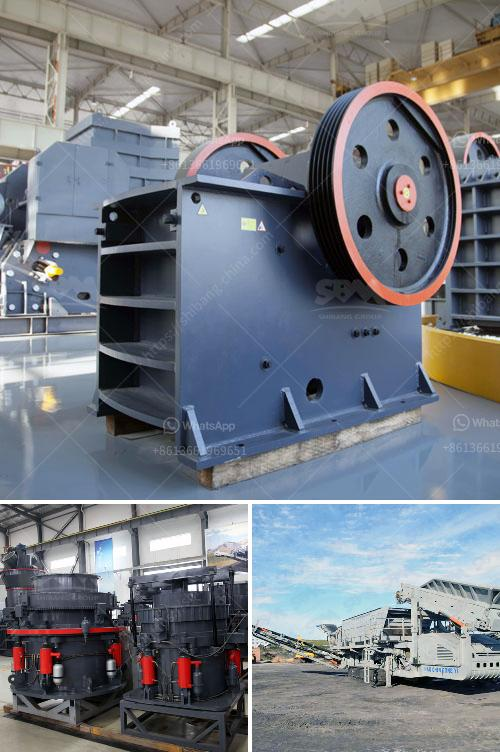

<h3>stone crusher price in india</h3>
Stone crusher price in India is fluctuating, depending on the different types of known factors in the industry. With the increasing number of stone crusher manufacturers, the competition of stone crusher marketing is intensified. The stone crusher price in India is divided into many stages, such as the primary crushing stage, secondary crushing stage, tertiary crushing stage, and so on.

As a manufacturer, you can trust, SBM for the high quality and good machine. Stone crusher price in India shows good overall performance for sale. With the long-term development of the country's infrastructure, the actual production of construction waste is increasing, and the recycling rate is quite low. To solve the problem, SBM had researched and developed the large-scale stone... crusher machine to meet the construction waste recycling needs. The mobile stone crusher plant is undoubtedly the best choice for all those who need efficient and environmentally friendly machinery for good-quality aggregate production in India.

SBM experts designed the best stone crusher plant layout and passed the CE & ISO9001:2000 certificate for our customers. With the help of such a broad platform as sales in the Internet, we did a good job in India. Recently, SBM signed a crushing production line project with a mining company in India. We are very pleased to announce that this cooperation has been further concluded on the basis of mutual trust and mutual benefit. Go ahead, make a big deal! SBM can help!

Typically the 200 tph stone crushers having than one crusher i.e., one primary and one secondary or one primary & two secondary crushers along with one or more vibratory screens are categorized as medium size crushers. The mined stones are transported mostly by truck/dumpers and unloaded in to elevated stone wells. The stones are fed by gravity to primary crushers. The Crushed stones are conveyed to vibratory screens. The screened products of various sizes are conveyed to stock piles by belt conveyors. The oversize is returned to secondary crushers for further crushing and back to the vibratory screen. Such type of medium type crushers has a production capacity in the range of 25 – 100 TPH.

In India, there are many suppliers and manufacturers of stone crusher machinery, such as shanghai SBM Company. As for the abundant mineral resources, stone jaw crusher machinery has large market in India. Stone crusher machinery prices vary from several thousand dollars to ten thousand dollars. But SBM is an international enterprise which... can give you the most competitive product price and cost of stone crusher plant in India. It can be widely used in different mineral ore production industry.

To suit the needs of the clients, the entire range of SBM mobile stone crusher price in India is set by the vibration feeder, jaw crusher, and cone crusher. Vibrating feeder is actually produced by the vibrant feeding functions SBM Machinery is actually a experienced feeder producer, specializing in mining equipment mainly including of vibrating feeder. Stone crusher price in India

Are you looking for the stone crusher price in India? Email us to get the quotation or visit our company. Chat Online with SBM to get price quotation and more info.
<h3>Contact us</h3><ul><li><strong>Whatsapp:&nbsp;<a href="https://wa.me/8613661969651">+8613661969651</a></strong></li><li><a href="https://swt.shibang-china.com/?git&amp;zhl&amp;stone crusher price in india"><strong>Online Service(chat now)</strong></a></li></ul><h3>Related</h3><ul><li><a href='brand new stone crusher for sale in the philippines.md'>brand new stone crusher for sale in the philippines</a></li><li><a href='ball mill koppers.md'>ball mill koppers</a></li><li><a href='mobile jaw crusher for sale south africa.md'>mobile jaw crusher for sale south africa</a></li><li><a href='coal mining machine undercuter.md'>coal mining machine undercuter</a></li><li><a href='ball milling machine in south africa.md'>ball milling machine in south africa</a></li></ul>