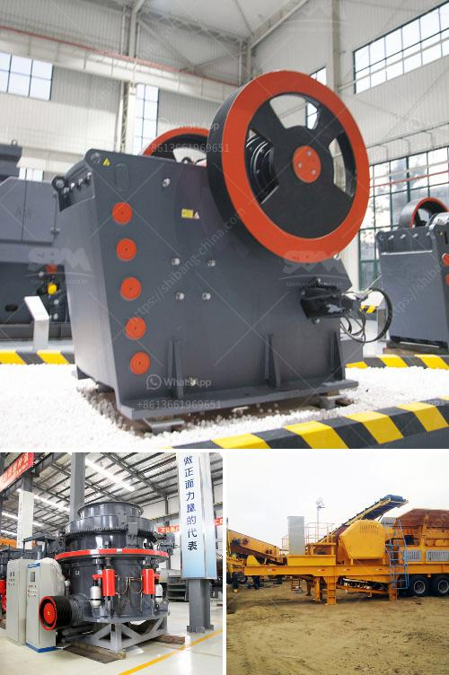

<h3>stone crusher price in pakistan</h3>
Stone crusher price is one of the factors determining the productivity of construction, mining, and quarrying industries. This crusher mainly consists of jaw crusher, impact crusher, cone crusher, sand making machine and vibrating screen. The most important factor driving the stone crusher price is the stone itself. Different types of crushers have different input sizes and different production capacities. The output granularity also depends on the customer's requirements.

When investing in a stone crushing plant, the price of the equipment is a big concern for customers. However, it is not the only factor affecting the crusher price. The quality of the equipment will also determine the price, and the price of high-quality equipment will be higher. On the contrary, the price of low-quality equipment may be cheaper, but it may have a shorter service life, lower output, and higher maintenance costs in the future.

In Pakistan, many stone crushing units are processing stones into different sizes for construction purposes. Small-scale stone crushing units are usually located in rural areas and towns. They are primarily owned and operated by less educated individuals and are scattered all over the country. Primary stone crushing equipment is usually jaw crusher called as primary crusher. Secondary crushing equipment is cone crusher, impact crusher and so on; vibrating screen sieves the mixture comes from crushers into several sizes according to the needs.

So, when we consider the price, there will be many aspects need to be considered, because different machine has the different price, supposing it is a small crushing plant or the raw material is relatively easy for crushing, one jaw crusher can sufficient do this job, but if the material is relatively hard and output of the particle size is better, it may have the jaw plus a cone crusher( or impact crusher) in crushing plant, and there still exist a situation that, in case it is not the fixed crushing place, then mobile crusher plant will take into account. And the price also related with the raw material you want to process, production capacity, feed size and discharge size, which equipment is suitable for you is according to your detailed requirements.

Stone crusher price is also affected by the cost exchange rate between China and Pakistan. American dollars are crushed against the local currency, so the exchange rate increases. Therefore, the price of stone crushing machinery varies in different regions. But it is not just the cost of equipment. The price of raw materials also directs the overall price of the crusher plant. Different raw materials account for different proportions in overall expenses. For example, the stone crusher in Pakistan used in minerals and stones mining, sand making or crushing production lines is mainly imported from abroad, and the price is expensive.

If you want to know more about stone crusher price in Pakistan, or any other information, please contact us, we will provide you with comprehensive technical support and thoughtful service.
<h3>Contact us</h3><ul><li><strong>Whatsapp:&nbsp;<a href="https://wa.me/8613661969651">+8613661969651</a></strong></li><li><a href="https://swt.shibang-china.com/?git&amp;zhl&amp;stone crusher price in pakistan"><strong>Online Service(chat now)</strong></a></li></ul><h3>Related</h3><ul><li><a href='clay mill roller balancing.md'>clay mill roller balancing</a></li><li><a href='roller mill calcium.md'>roller mill calcium</a></li><li><a href='mineral pulverising mills in south africa.md'>mineral pulverising mills in south africa</a></li><li><a href='steel slag recycling plant.md'>steel slag recycling plant</a></li><li><a href='kenya granite stone crushing plant.md'>kenya granite stone crushing plant</a></li></ul>