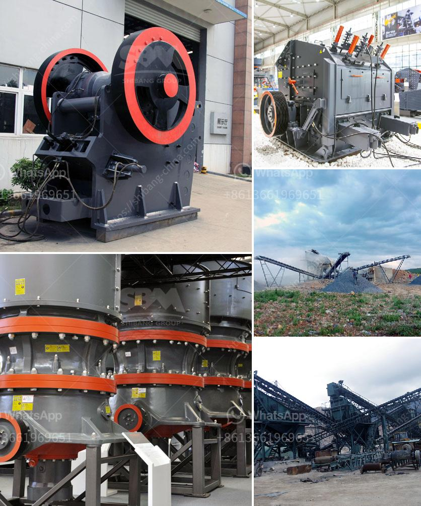

<h3>stone crusher process</h3>
Stone crusher process is a global phenomenon that has been taking place over the years. It is a way of breaking stones into tiny particles with various sizes. This process is carried out by using a crusher machine.

Crushing stones have been used worldwide for thousands of years. From the simplest hand tools to the most modern crushing equipment, stone crushers have played a major role in the advancement of civilizations. In modern times, industrialization has also paved the way for the emergence of stone crusher industries.

The stone crusher process begins with the feeding of the stones into the machine, which is followed by the crushing process. Once the stones are crushed, they are separated into different sizes through a screening process. The stones that meet the desired size are transported to the pile by conveyor belts, while those that do not meet the required specifications are sent back to the crusher for further crushing.

There are various types of crushers utilized in this process, each with its unique characteristics and benefits. Jaw crushers are commonly used for primary crushing, while impact crushers are used for secondary or tertiary crushing. Cone crushers, on the other hand, are used in the final stage of the crushing process to produce cubicle-shaped particles.

The stone crusher process is characterized by the use of advanced technologies, such as improved wear resistance of wear-resistant materials and refined cavity design. These technologies help to extend the life of machine, reduce downtime and maintain the efficiency of the crushing process.

Another important factor in the stone crusher process is the positioning of the equipment. To ensure better performance, it is important to choose the right location for the crushing operation. This is particularly important for portable crushers because they can be moved from one location to another.

Stones are a valuable resource that can be utilized for various purposes. For instance, crushed stones are used for road construction, landscaping, and making concrete. In addition, stones are also used in the production of lime, fertilizer, and other industrial products.

Overall, the stone crusher process involves several steps, starting from the feeding of stones into the machine to the final stage of crushing. The crushed stones are then screened to separate them into different sizes. Various types of crushers are used in this process, each with its unique characteristics and benefits.

The stone crusher process plays a significant role in the advancement of civilizations and the development of industries. It is a global phenomenon that has been used for thousands of years and continues to be an important tool in various applications. Whether it is road construction or industrial production, the stone crusher process will always be an integral part of our society.
<h3>Contact us</h3><ul><li><strong>Whatsapp:&nbsp;<a href="https://wa.me/8613661969651">+8613661969651</a></strong></li><li><a href="https://swt.shibang-china.com/?git&amp;zhl&amp;stone crusher process"><strong>Online Service(chat now)</strong></a></li></ul><h3>Related</h3><ul><li><a href='uses of stone crusher equipment pdf.md'>uses of stone crusher equipment pdf</a></li><li><a href='operating parameter of vertical roller mill.md'>operating parameter of vertical roller mill</a></li><li><a href='manganese limestone processing unit.md'>manganese limestone processing unit</a></li><li><a href='ball mill 3 ton.md'>ball mill 3 ton</a></li><li><a href='used gold stamp mill for sale in south africa.md'>used gold stamp mill for sale in south africa</a></li></ul>