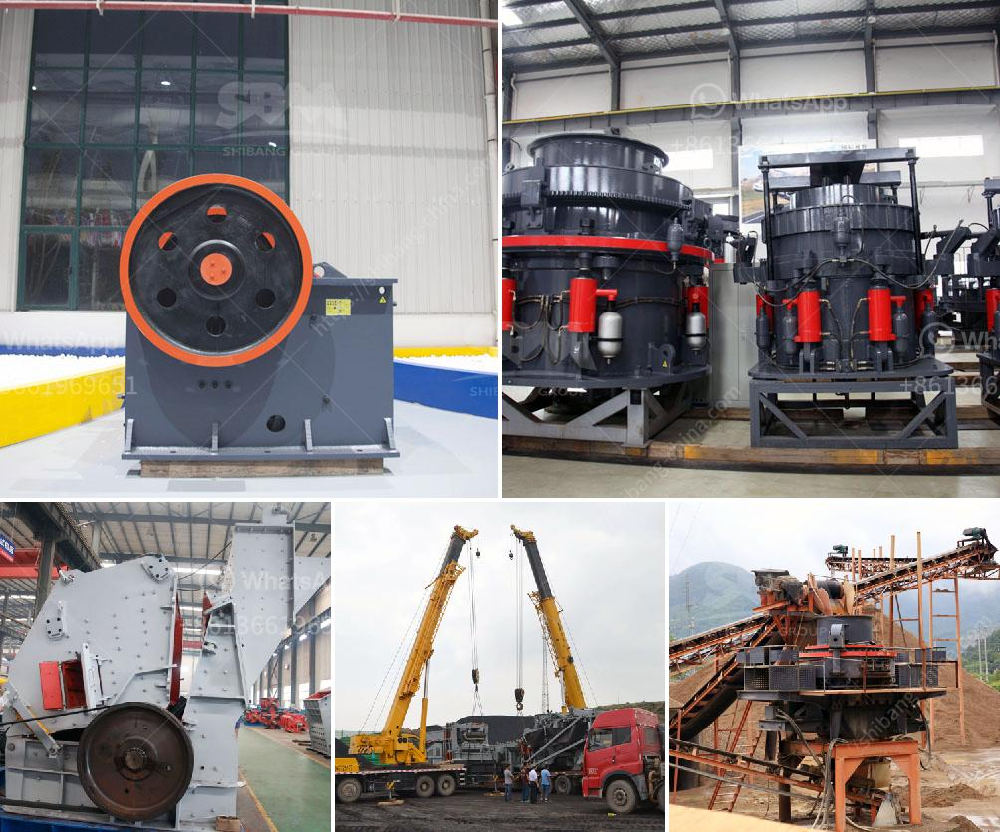

<h3>stone crusher project report</h3>
Stone crusher project report can be a useful for people; stone crusher project has been a little affected because of global economic downturn to some extent, so construction machinery and material handling can be a manufacturer and supplier of stone crusher plant project report. We provide technical and construction services to each customer.

stone crusher project report India is a mineral rich country and produces about 89 minerals. However 80 percent of the mining acitivity is confined to coal. The other minerals and metals mined include zinc, gold, copper, iron, bauxite and uranium and so on. The stone crusher project is aimed at reducing the poverty level of the rural areas. So, stone crusher project would be a good industry in the area.

The stone crusher project also known as stone crusher plant, is a kind of stone crusher project report pdf. The stone crusher project report deals with the production and use of stones for producing manufactured sand, which is defined as aggregate material less than 4 mm, processed from crushed rock or gravel, intended for construction use.

The motivation for this project is the increased miss balance between the need for aggregates in the society and the need to develop concept solutions for the use of manufactured sand as concrete aggregate. The stone crusher project report deals with the production and use of stones for producing manufactured sand, which is defined as aggregate material less than 4 mm, processed from crushed rock or gravel, intended for construction use.

The motivation for this project is the increased miss balance between the need for aggregates in the society and the need to develop concept solutions for the use of manufactured sand as concrete aggregate. The detailed project reports cover all the aspects of business, from analyzing the market, confirming availability of various necessities such as plant & machinery, raw materials to forecasting the financial requirement. If you need the details of the stone crusher project report, please contact us. Popular Stone Crusher Types

These are the oldest type of and most commonly used crushers in use and have changed little from the original design. In Jaw Crusher the feed is compressed between a stationary and a movable surface.

The impact crusher uses the energy contained in falling stone, plus the power imparted by the massive impellers. Rock fed into the impact crusher falls directly on to the impellers and rotates away from each other, turning up and outward, at speeds from 250 to 1000 rpm depending on the desired size of finished product.

Cone crusher combines the best of these technologies to provide the highest capacity, the best product shape, the highest yield, easy automation, and the greatest possible reliability and flexibility. From limestone to taconite, from ballast production to manufactured sand, and from small portable plants, cone crushers provide unbeatable performance in secondary, tertiary, and quaternary applications.
<h3>Contact us</h3><ul><li><strong>Whatsapp:&nbsp;<a href="https://wa.me/8613661969651">+8613661969651</a></strong></li><li><a href="https://swt.shibang-china.com/?git&amp;zhl&amp;stone crusher project report"><strong>Online Service(chat now)</strong></a></li></ul><h3>Related</h3><ul><li><a href='artificial stone production line floor.md'>artificial stone production line floor</a></li><li><a href='two roll mill machine.md'>two roll mill machine</a></li><li><a href='cost of feldspar crushing machine pakistan.md'>cost of feldspar crushing machine pakistan</a></li><li><a href='jaw crusher pe 1000 x.md'>jaw crusher pe 1000 x</a></li><li><a href='crusher impact germany.md'>crusher impact germany</a></li></ul>