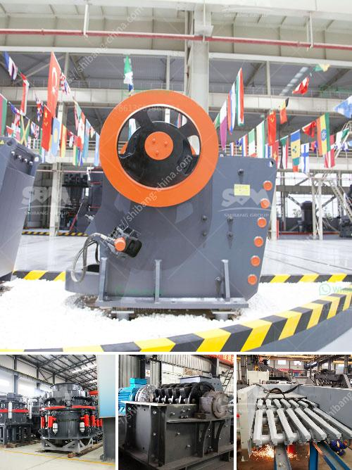

<h3>stone crusher quarry</h3>
Stone crusher quarry is a large-scale mining machinery and equipment, which strongly contributes to the development of the economy in the village whose existence is inseparable from the quarry. Because it is a source of raw materials, the absence of the quarry in the village will be felt by the community. Quarry operations are a high-risk activity with round-the-clock operations, blasting activities, and crusher workers that require constant vigilance to mitigate risks to staff and the public.

Blasting in the quarry is controlled by a set of safety detonators that are timed with a break between explosions. This ensures the safety of the quarry workers and the nearby communities from potential damage or harm. The noise from the blasts can be significant, but measures are taken to mitigate the impact, such as using different types of explosives and drilling techniques.

The primary crusher works on a rotating, heavy-duty steel rotor, in which the blow bars impact and crush the feed as it enters the cavity. This machine utilizes the impact energy to crush the rocks and efficiently break them apart. The impact force generated during the collision of the rocks with the rotor creates high-stress forces in the primary crusher and increases the risk of accidents if not properly maintained and operated.

To ensure the safety of the crusher workers, the primary crusher is equipped with safety guards, maintaining a safe working environment. Regular maintenance and inspections are carried out to monitor the condition of the machinery and detect any potential faults or failures in advance.

Furthermore, the primary crusher is usually placed at the forefront of the quarry operation, close to the face of the rock being extracted. This placement allows for efficient transportation of the crushed material to the nearby stockpile or directly to the secondary crusher.

The secondary crusher further reduces the size of the crushed stone to meet the specific requirements of different construction projects. It operates similarly to the primary crusher, utilizing impact energy to crush the rocks. The secondary crusher is equipped with a screen to separate the oversized stones from the smaller ones.

Quarry operations require skilled workers who are well-trained in the safe operation of heavy machinery and equipment. Safety training is essential to reduce the risk of accidents. Workers must wear personal protective equipment, such as helmets, safety goggles, and earplugs, to protect themselves from potential hazards.

In conclusion, the stone crusher quarry is a valuable addition to our village's economic development. It provides much-needed employment opportunities in the area, and ensures a sustainable source of raw materials for construction projects. However, proper safety measures must be implemented to mitigate the risks associated with quarry operations. Only with a well-trained and safety-conscious workforce can we continue to reap the benefits of the stone crusher quarry.
<h3>Contact us</h3><ul><li><strong>Whatsapp:&nbsp;<a href="https://wa.me/8613661969651">+8613661969651</a></strong></li><li><a href="https://swt.shibang-china.com/?git&amp;zhl&amp;stone crusher quarry"><strong>Online Service(chat now)</strong></a></li></ul><h3>Related</h3><ul><li><a href='price of iron ore crusher machine.md'>price of iron ore crusher machine</a></li><li><a href='stationary crushers and screens.md'>stationary crushers and screens</a></li><li><a href='130 150 jaw crusher.md'>130 150 jaw crusher</a></li><li><a href='complete stone crusher set.md'>complete stone crusher set</a></li><li><a href='types of limestone screening.md'>types of limestone screening</a></li></ul>