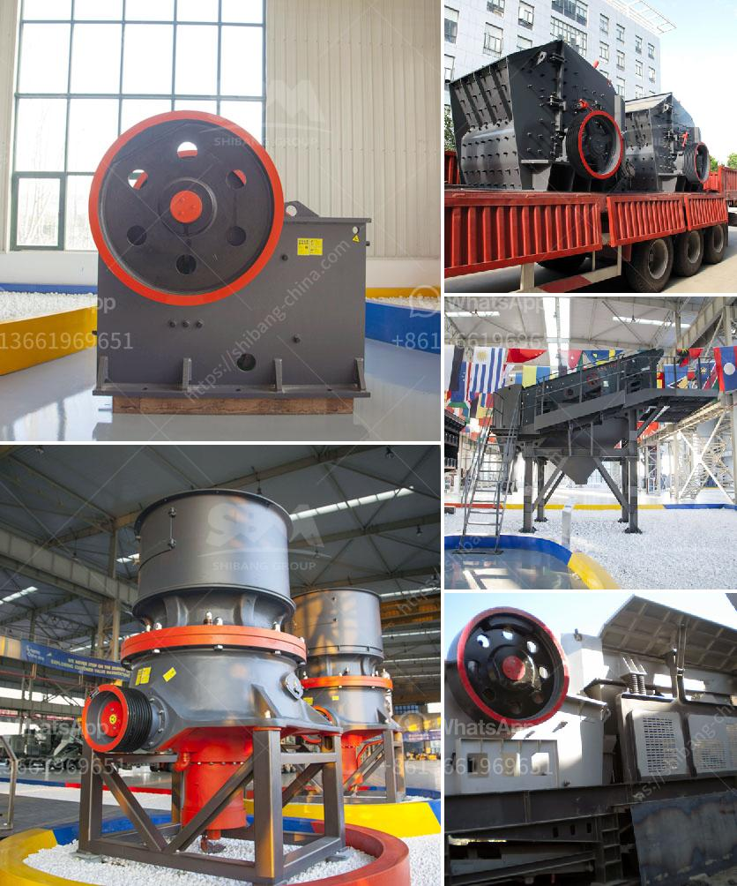

<h3>stone crusher sale</h3>
Stone crusher machines are widely used in mining industry. There are various types of crusher machine, including jaw crusher, impact crusher, cone crusher, sand making machine, hammer crusher, and mobile crusher plant, etc. Following is the detail introduction of stone crusher machine type.

The jaw crusher machine is often used as the primary crusher in the crushing process. It can crush various materials with a compressive strength of not more than 320Mpa, such as limestone, granite, basalt, iron ore, river pebble, and others. The machine is widely used in mining, building materials, metallurgy, chemical industry, and many other fields.

The impact crusher machine is suitable for medium and fine crushing of various soft and medium-hard ores as well as coarse crushing of fragile materials with a compressive strength of not more than 350Mpa. It is widely used in expressway construction, water conservancy engineering, construction gravel, machine-made sand, mineral processing, and other fields.

The cone crusher is mainly used for crushing hard ores and rocks such as granite, basalt, river pebble, and others. It is composed of a frame, an eccentric sleeve, a transmission device, a hollow eccentric shaft, a bowl-shaped bearing, a crushing cone, and adjusting devices. It is widely used in mining, metallurgy, construction, road construction, chemical industry, and other fields.

The sand making machine is used for fine crushing and shaping of various medium-hard ores and rocks. It can provide high-quality aggregates for highways, railways, buildings, bridges, airports, water conservancy, and hydropower projects. It is one of the necessary equipment for artificial sand production.

The hammer crusher machine is mainly used for crushing brittle materials, including coal, salt, gypsum, brick, limestone, etc. It is especially suitable for construction waste disposal due to its large crushing ratio, uniform product size, and high production capacity.

The mobile crusher plant is a new type of stone crushing equipment based on the market demand. It adopts a new chassis structure and can be moved flexibly. It is widely used in mining, construction waste disposal, construction waste crushing, highway, railway, bridge construction, and other industries.

In conclusion, the stone crusher machine plays vital roles in the mining process and construction industry. They are mainly used to crush all kinds of stone materials into small size necessaary for the further process. Different types of stone crusher machines can be selected flexibly according to customers' requirements and actual conditions. And it is worthy to mention that crushers play an important role in the construction industry as well. With the rapid development of urbanization, the demand for constructions fuels the crusher industry. Furthermore, the increasing of infrastructure projects in developing countries also propels the growth of the stone crusher market. With the continuous improvement and upgrading of mining machinery technology, stone crusher machines are constantly improving in terms of performance, automation, and intelligence, and have become one of the indispensable equipment in the crushing industry.
<h3>Contact us</h3><ul><li><strong>Whatsapp:&nbsp;<a href="https://wa.me/8613661969651">+8613661969651</a></strong></li><li><a href="https://swt.shibang-china.com/?git&amp;zhl&amp;stone crusher sale"><strong>Online Service(chat now)</strong></a></li></ul><h3>Related</h3><ul><li><a href='coal crusher machine indonesia supplier.md'>coal crusher machine indonesia supplier</a></li><li><a href='stone crusher for rent.md'>stone crusher for rent</a></li><li><a href='used chrome ore mining crushing equipment crusher.md'>used chrome ore mining crushing equipment crusher</a></li><li><a href='brazil best crusher manufacturing companies.md'>brazil best crusher manufacturing companies</a></li><li><a href='jaw crusher machine cost.md'>jaw crusher machine cost</a></li></ul>