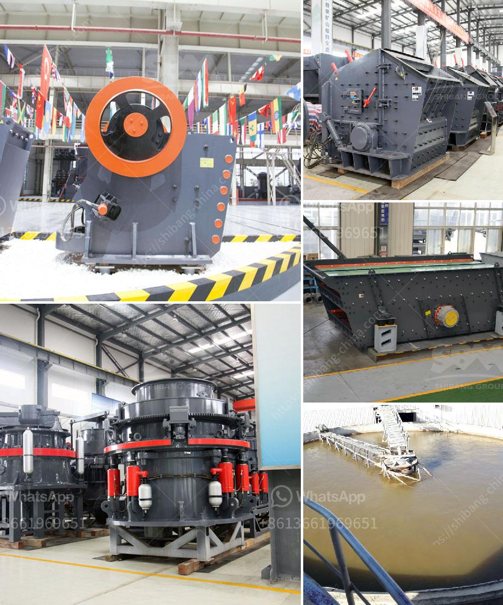

<h3>stone crusher sand block maker</h3>
Stone crusher, also called sand block maker, is widely used to process various kinds of stones into sand. Nowadays, the demand for sand and gravel aggregate is continuously growing, and natural sand resources are limited. The natural sand and gravel resources formed by hundreds of thousands of years in many countries and regions are almost exhausted. As a result, artificial sand and gravel have become increasingly important.

Stone crusher, also known as sand making machine, is used to produce sand and gravel aggregate. Sand making machine adopts dual motor drive, with a high degree of automation, low noise, and high crushing efficiency. It can process different kinds of materials like rocks, pebbles, granite, limestone, concrete, etc. into sand of uniform particle size. The sand produced by the stone crusher can be used in various construction projects, such as road construction, building construction, water conservancy and hydropower, bridges and tunnels, etc.

Stone crushers are also capable of producing excellent particle shapes, reducing the content of needle-like and flake-like materials, and making the end product more cubic. This is particularly important for sand and gravel aggregate used in the construction industry, as better particle shapes can improve the strength and durability of concrete.

The stone crusher sand block maker is equipped with a variety of crushing methods, making it highly versatile. It can crush materials into sand and gravel aggregate with different granularity. Moreover, it also has the functions of sand making and shaping. Users can adjust the crusher's discharge size according to their own production needs.

In summary, stone crusher sand block maker is used to process various kinds of stones into sand. It is widely used in the construction industry and can produce high-quality sand and gravel aggregate. With the increasing demand for sand and gravel, the importance of artificial sand is becoming more and more apparent. The stone crusher sand block maker plays a vital role in this process, providing reliable and high-quality sand and gravel aggregate for construction projects.
<h3>Contact us</h3><ul><li><strong>Whatsapp:&nbsp;<a href="https://wa.me/8613661969651">+8613661969651</a></strong></li><li><a href="https://swt.shibang-china.com/?git&amp;zhl&amp;stone crusher sand block maker"><strong>Online Service(chat now)</strong></a></li></ul><h3>Related</h3><ul><li><a href='large capacity ton per hour limestone crushers.md'>large capacity ton per hour limestone crushers</a></li><li><a href='harga mobile crusher in indonesia.md'>harga mobile crusher in indonesia</a></li><li><a href='machines de crushine primaires.md'>machines de crushine primaires</a></li><li><a href='barite powder making.md'>barite powder making</a></li><li><a href='crusher manufactures in europe.md'>crusher manufactures in europe</a></li></ul>