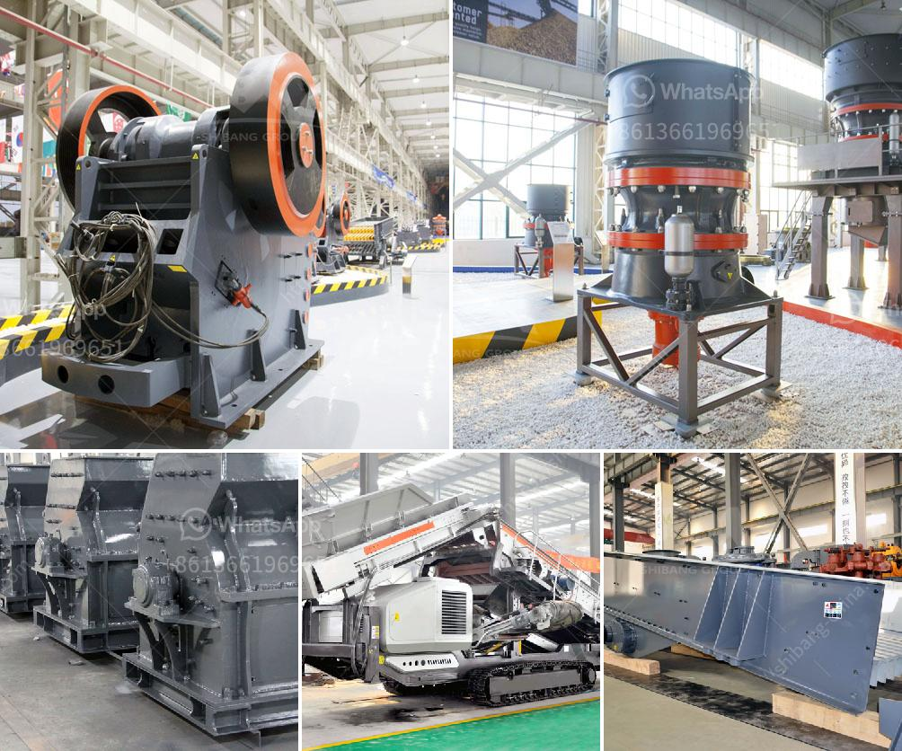

<h3>stone crusher used for sale spain</h3>
Stone crushing equipment has become increasingly popular in recent years for many reasons such as its efficiency, lower operating costs, and ease of installation and maintenance. Regardless of the type of project, crushing equipment can greatly benefit the mining and construction industries.

In Spain, crushing equipment is widely used for a variety of purposes such as crushing rocks to produce coarse aggregates for concrete production or crushing large stones for road construction. Notably, many companies that operate under these industries heavily rely on stone crushers due to their effectiveness, reliability, and high return on investment.

One commonly used stone crusher is the jaw crusher. The jaw crusher is widely used in mining, smelting, building materials, roads, railways, water conservancy, chemical industry, and many other industries. It is mainly used for crushing various ores and bulk materials into medium-grained particles. Additionally, it can crush materials with compressive strength not exceeding 320MPa.

Besides the jaw crusher, there are also impact crushers, cone crushers, and gyratory crushers available for sale in Spain. These crushers are generally used for secondary crushing in various crushing circuits. The secondary crushing process is often utilized to produce final aggregate products or to prepare material for final processing.

When looking to purchase a stone crusher in Spain, it is essential to consider various factors. First, the size and hardness of the material being crushed should be taken into account. Some crushers are better suited for specific types of materials, while others are versatile enough to handle a wide range of materials.

Second, the desired output size must be considered. Different crushers have different output capacities, and it is crucial to choose a crusher that can achieve the required output size. Additionally, the shape of the final product should also be considered as it can impact the quality of the aggregate or other end products.

Furthermore, the cost of the stone crusher and its maintenance should be taken into consideration. It is important to choose a crusher that offers a balance between initial cost and long-term operating costs. Assessing the availability of spare parts and the ease of maintenance can also help in making an informed decision.

In conclusion, stone crushers are widely used in the mining and construction industries in Spain. Their efficiency, ease of installation, and low operating costs make them a popular choice for various crushing applications. Whether one is in need of a jaw crusher, impact crusher, cone crusher, or gyratory crusher, there are plenty of options available on the market. Considering factors such as material hardness, desired output size, and cost of ownership can help in choosing the right stone crusher for a specific project in Spain.
<h3>Contact us</h3><ul><li><strong>Whatsapp:&nbsp;<a href="https://wa.me/8613661969651">+8613661969651</a></strong></li><li><a href="https://swt.shibang-china.com/?git&amp;zhl&amp;stone crusher used for sale spain"><strong>Online Service(chat now)</strong></a></li></ul><h3>Related</h3><ul><li><a href='properties of gold mining in south africa.md'>properties of gold mining in south africa</a></li><li><a href='ball mill for size reduct.md'>ball mill for size reduct</a></li><li><a href='crusher machinery from china.md'>crusher machinery from china</a></li><li><a href='hammer mill clay.md'>hammer mill clay</a></li><li><a href='cost new jaw crusher.md'>cost new jaw crusher</a></li></ul>