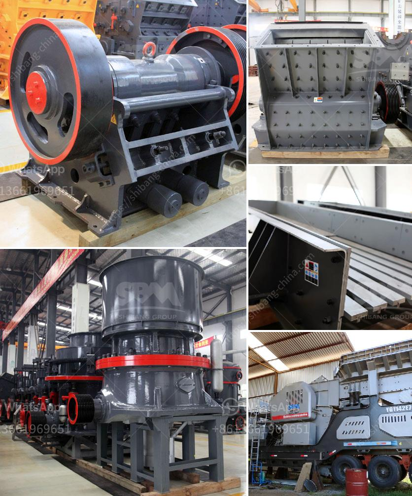

<h3>stone crusher40 ton jam</h3>
Stone crusher 40 ton/jam is a machine used to break down large rocks into smaller pieces. A stone crusher can be equipped with different types of hammers depending on the material it is being used to crush and the desired output size. The machine has a high crushing ratio, making it suitable for both primary and secondary crushing.

One of the key features of a stone crusher 40 ton/jam is its power. The machine operates using a powerful motor, which generates enough energy to crush even the hardest rocks. This means that it is capable of crushing large rocks into smaller pieces with ease.

The stone crusher 40 ton/jam is also highly efficient. It can crush rocks at a consistent rate, ensuring a continuous flow of crushed materials. This makes it ideal for projects that require a large quantity of crushed materials, such as road construction and building projects.

Another advantage of the stone crusher 40 ton/jam is its versatility. The machine can be used to crush a wide variety of materials, including granite, limestone, concrete, and more. This makes it suitable for use in different industries, such as mining, construction, and recycling.

In terms of maintenance, the stone crusher 40 ton/jam is designed to be easy to maintain. It has a simple structure, consisting of a crusher chamber, a rotor, and a feed hopper. This reduces the need for regular maintenance and increases the machine's lifespan.

The machine is also equipped with safety features to ensure the safety of the operator. It is designed with a protective cover, which prevents any accidental contact with the moving parts. Additionally, it has an emergency stop button, allowing the operator to quickly stop the machine in case of an emergency.

Overall, the stone crusher 40 ton/jam is a powerful and efficient machine. It can crush large rocks into smaller pieces, making it suitable for various applications. With its high crushing ratio and versatility, it is ideal for use in different industries. Additionally, its easy maintenance and safety features make it a reliable and safe option for crushing rocks. Whether it is for road construction, mining, or recycling, the stone crusher 40 ton/jam is a valuable machine to have.
<h3>Contact us</h3><ul><li><strong>Whatsapp:&nbsp;<a href="https://wa.me/8613661969651">+8613661969651</a></strong></li><li><a href="https://swt.shibang-china.com/?git&amp;zhl&amp;stone crusher40 ton jam"><strong>Online Service(chat now)</strong></a></li></ul><h3>Related</h3><ul><li><a href='feasibility study of palm kernel crushing plant.md'>feasibility study of palm kernel crushing plant</a></li><li><a href='sand making crusher.md'>sand making crusher</a></li><li><a href='mining belt conveyor systems.md'>mining belt conveyor systems</a></li><li><a href='diamond wash plants for sale in south africa.md'>diamond wash plants for sale in south africa</a></li><li><a href='crusher in argentina stone crusher.md'>crusher in argentina stone crusher</a></li></ul>