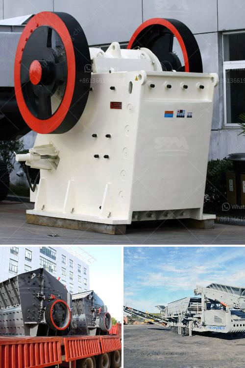

<h3>stone crushers in bucaramanga</h3>
Bucaramanga, a city located in northeastern Colombia, is known for its vibrant culture, bustling economy, and strategic position as a transportation hub. As the city continues to grow, the demand for construction projects has increased significantly. One vital component of these projects is the use of stone crushers, which play a crucial role in breaking down rocks into smaller pieces for construction purposes.

Stone crushers are heavy-duty machines designed to crush large rocks into smaller pieces or gravel. These machines come in various sizes and types, ranging from small handheld units to large industrial crushers. They are commonly used in construction, mining, and quarrying industries to break down materials such as stones, concrete, and asphalt.

Bucaramanga's construction industry heavily relies on stone crushers due to the abundance of rock formations in the region. These machines are essential for creating building foundations, roads, bridges, and various other infrastructure projects. Stone crushers efficiently crush large rocks into smaller sizes, ensuring that the construction materials meet the specific requirements of each project.

One of the main advantages of stone crushers is that they can process a vast amount of rocks and stones within a short period. This accelerates the construction process and saves time, allowing projects to be completed faster. Additionally, as stone crushers are typically available locally, they contribute to the local economy and provide employment opportunities for individuals in the region.

Furthermore, stone crushers provide a sustainable solution for the construction industry in Bucaramanga. As the city experiences rapid urbanization, the demand for construction materials skyrockets, increasing the pressure on natural resources. By using stone crushers, builders can rely on recycled aggregates or crushed stones, minimizing the need for new raw materials and reducing their ecological footprint.

Stone crushers also address the issue of waste management in the construction industry. Rather than disposing of excess rocks and stones, these machines can crush and reuse them in future projects. This not only reduces waste but also cuts down transportation costs associated with sourcing new materials.

In Bucaramanga, stone crushers have proven to be an efficient and cost-effective solution for construction projects. They improve the construction industry's productivity while promoting sustainability and waste reduction. Additionally, they provide job opportunities for local residents and stimulate the regional economy.

However, it is essential to ensure that stone crushers are operated safely and with proper maintenance. Operators should follow strict guidelines to prevent accidents and minimize their impact on the environment. Regular inspections, maintenance checks, and employee training are crucial to ensure the long-term sustainability of the stone crushing industry in Bucaramanga.

In conclusion, stone crushers are indispensable for the construction industry in Bucaramanga. These machines help break down rocks into smaller sizes, saving time and meeting the specific requirements of each project. Furthermore, they contribute to the local economy, promote sustainability, and address waste management concerns. By embracing stone crushers, Bucaramanga's construction industry can continue to thrive while preserving the environment for future generations.
<h3>Contact us</h3><ul><li><strong>Whatsapp:&nbsp;<a href="https://wa.me/8613661969651">+8613661969651</a></strong></li><li><a href="https://swt.shibang-china.com/?git&amp;zhl&amp;stone crushers in bucaramanga"><strong>Online Service(chat now)</strong></a></li></ul><h3>Related</h3><ul><li><a href='machinery for copper plant.md'>machinery for copper plant</a></li><li><a href='jaw crusher mem fr.md'>jaw crusher mem fr</a></li><li><a href='stone powder machine.md'>stone powder machine</a></li><li><a href='salvage value of crusher machine.md'>salvage value of crusher machine</a></li><li><a href='mobile quarry crushing plant for sale in jamaica.md'>mobile quarry crushing plant for sale in jamaica</a></li></ul>