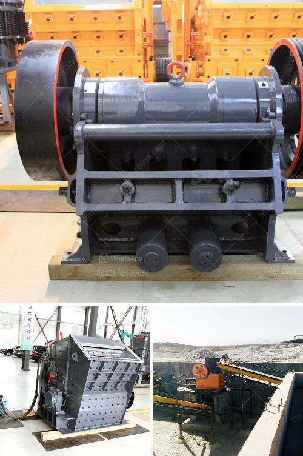

<h3>stone crushers in south africa</h3>
Stone crushers are widely used in various sectors of the economy such as mining, construction, infrastructure, highways, and railways, to name a few. South Africa is blessed with abundant mineral resources, which is one of the factors that attracts many investors to this country. With the continuous development of infrastructure, mining activities have become more advanced, which increased the demand for stone crushers in South Africa.

Stone crushers are widely used in the mining, smelting, construction materials, highways, railways, water conservancy, and chemical industries. There are many types of stone crushers, including jaw crusher, impact crusher, hammer crusher, cone crusher, mobile crusher, roll crusher, vertical shaft impact crusher, compound crusher, single stage crusher, tertiary impact crusher, marble crusher, basalt crusher, limestone crusher, concrete crusher, etc. The overall stone crusher equipment market has been growing at a tremendous pace due to the rising demand for stones from various sectors such as mining, construction, infrastructure, and others.

The market for stone crushers in South Africa has been growing exponentially due to the rise in mining activities, infrastructure development, and real estate projects. In addition, the increasing demand for affordable housing and other infrastructure projects in emerging economies such as South Africa, Nigeria, and Kenya is expected to drive the stone crusher market growth during the forecast period. Furthermore, technological advancements in the field of stone crushing and screening equipment are expected to provide lucrative opportunities for market players.

South Africa has a significant number of stone crusher manufacturers. These manufacturers have a wide variety of machines to cater to different client requirements. The most common stone crushers used in the country include jaw crushers, cone crushers, impact crushers, hammer crushers, and mobile crushers. These stone crushers are widely used in the various mining and construction industries with the increasing popularity of stone crushers, the overall market size in terms of revenue is expected to grow significantly over the forecast period.

The stone crusher market in South Africa is highly competitive as several established players compete with smaller local players. All the players in the market are looking to expand their presence in the upcoming years due to the booming construction and infrastructure activities in South Africa. Furthermore, key players are focusing on technological advancements and new product launches to stay ahead of the competition. For instance, Terex Corporation launched new crushing plants for the primary, secondary, and tertiary crushing applications to improve the overall stone crusher market share in South Africa.

In conclusion, stone crushers are widely used in various sectors of the economy such as mining, infrastructure, construction, highways, and railways, to name a few. South Africa has a significant number of stone crusher manufacturers, and the market is competitive. With the continuous development of infrastructure, mining activities have become more advanced, which increased the demand for stone crushers in South Africa. Technological advancements in the field of stone crushing and screening equipment are expected to provide lucrative opportunities for market players. Overall, the stone crusher market in South Africa is expected to grow at a significant rate during the forecast period.
<h3>Contact us</h3><ul><li><strong>Whatsapp:&nbsp;<a href="https://wa.me/8613661969651">+8613661969651</a></strong></li><li><a href="https://swt.shibang-china.com/?git&amp;zhl&amp;stone crushers in south africa"><strong>Online Service(chat now)</strong></a></li></ul><h3>Related</h3><ul><li><a href='suoer fine mill grinder.md'>suoer fine mill grinder</a></li><li><a href='used carbon grinding production line.md'>used carbon grinding production line</a></li><li><a href='grinding raymond mill.md'>grinding raymond mill</a></li><li><a href='crusher allis cone chalmers mod 500.md'>crusher allis cone chalmers mod 500</a></li><li><a href='vertical mill working principle of the hydraulic.md'>vertical mill working principle of the hydraulic</a></li></ul>