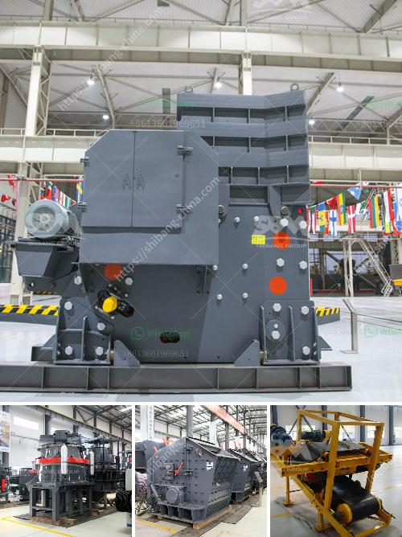

<h3>stone crushers looking for partners</h3>
Stone crushers are essential mining equipment for crushing, grinding, ore dressing, and recycling industries. These devices offer exceptional performance when it comes to crushing, grinding, and recycling. Since the mid-19th century, stone crushers have played a vital role in the mining industry. These machines are no different today as they deliver the same high-quality results for which they have been known for centuries.

However, finding suitable partners for stone crushers can be challenging. Many entrepreneurs and investors may overlook the potential of this industry and its lucrative opportunities. As a result, stone crusher manufacturers and distributors often struggle to connect with competent partners who can help them expand their business. This article aims to shed light on the benefits of partnering with stone crusher manufacturers and distributors.

One of the primary advantages of partnering with stone crusher manufacturers is accessing state-of-the-art technology. These manufacturers invest heavily in research and development to improve their products' efficiency, reliability, and safety. Collaborating with them allows partners to leverage their cutting-edge technologies and offer customers the latest advancements in stone crushing equipment.

Additionally, partnering with stone crusher manufacturers paves the way for lucrative business opportunities. As the demand for building materials, such as crushed stones, gravels, and sand, continues to rise, the potential for profit grows. Stone crushers are essential for producing high-quality materials used in infrastructure development, such as roads, railways, airports, and buildings. By partnering with stone crusher manufacturers, entrepreneurs can tap into this ever-growing market and establish a profitable business.

Furthermore, partnering with stone crusher distributors can offer a wider customer base and increased market reach. These distributors have established networks that can facilitate the distribution and sale of stone crushers. By joining forces with them, manufacturers can expand their presence and penetrate new markets more effectively. This collaboration can lead to increased sales and revenue generation.

Partnership opportunities in the stone crusher industry are not limited to manufacturers and distributors alone. Entrepreneurs who specialize in complementary services, such as maintenance, repair, and spare parts, can also find profitable partnerships within this sector. Stone crushers require regular maintenance to ensure optimal performance and prevent breakdowns. Service providers who specialize in stone crusher maintenance and repair can work closely with manufacturers and distributors, offering their expertise to customers. This collaborative approach creates a win-win situation for all parties involved, as customers receive efficient maintenance services while service providers grow their businesses.

In conclusion, stone crushers are indispensable equipment in the mining industry, and partnering with stone crusher manufacturers, distributors, or complementary service providers can open doors to lucrative business opportunities. These partnerships offer access to state-of-the-art technology, wider market reach, and potential for increased profits. Entrepreneurs and investors interested in this industry should explore partnership possibilities to capitalize on the ever-growing demand for high-quality crushed stones and building materials.
<h3>Contact us</h3><ul><li><strong>Whatsapp:&nbsp;<a href="https://wa.me/8613661969651">+8613661969651</a></strong></li><li><a href="https://swt.shibang-china.com/?git&amp;zhl&amp;stone crushers looking for partners"><strong>Online Service(chat now)</strong></a></li></ul><h3>Related</h3><ul><li><a href='portable jaw crusher.md'>portable jaw crusher</a></li><li><a href='used stone cursher machinery in uae.md'>used stone cursher machinery in uae</a></li><li><a href='how to make good with limestone powder.md'>how to make good with limestone powder</a></li><li><a href='100tph vibratory feeder.md'>100tph vibratory feeder</a></li><li><a href='ball mill mesh size.md'>ball mill mesh size</a></li></ul>