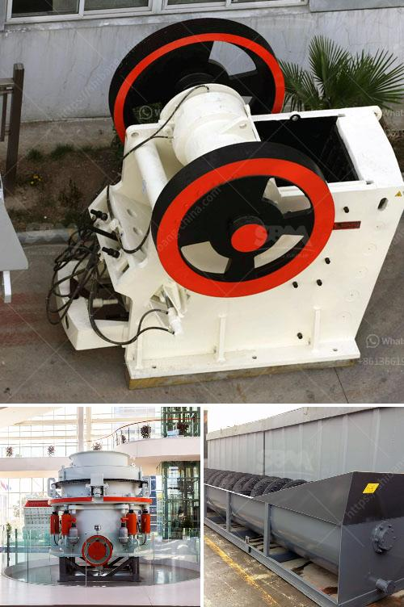

<h3>stone crushing equipment</h3>
Stone crushing equipment is widely used in the mining, construction, building materials, and chemical industries to crush all kinds of stones and minerals. These machines can process rocks of various sizes and types, such as granite, limestone, diabase, basalt, shale, river pebbles, and more. With the popularity of ore crushing and processing, stone crushing equipment has become a lucrative investment option.

One of the key benefits of stone crushing equipment is its ability to produce a uniform product size, ensuring the end product is of high quality. This is particularly important in the construction industry where poor quality aggregates can negatively impact the strength and durability of buildings and structures. Stone crushing machines achieve these goals by crushing large rocks into smaller, more manageable sizes.

There are different types of stone crushing equipment available in the market. Jaw crushers, cone crushers, impact crushers, and roll crushers are the most commonly used ones. Jaw crushers are generally used in primary crushing stages, while cone crushers are typically used in secondary or tertiary crushing stages. Impact crushers are often used for the final stage of crushing, producing a cubic-shaped end product, and roll crushers are used in the mineral processing industry for crushing various ores.

The selection of stone crushing equipment depends on various factors, including the characteristics of the rocks to be crushed, the desired product size, and the investment budget. Different crushers have different capacity ranges and their own advantages and disadvantages. For example, jaw crushers have a simple structure, reliable operation, and low operating costs. They are suitable for crushing various materials with a compressive strength of up to 320 MPa. On the other hand, cone crushers have high production capacity and good final product quality but are generally more expensive to operate.

Stone crushing equipment is usually accompanied by a vibrating feeder, conveyor belt, and vibrating screen. The feeding system ensures that the material is evenly and continuously fed into the crushers, while the conveyor belt transports the crushed material to the next stage. The vibrating screen separates the crushed stones into different sizes, allowing for the selection of specific product sizes.

As with any industrial machinery, stone crushing equipment requires regular maintenance to ensure its optimal performance and productivity. Regular inspection, lubrication, and cleaning of the equipment, as well as regular replacement of worn-out parts, are necessary to extend its lifespan and avoid unexpected breakdowns.

In conclusion, stone crushing equipment plays a crucial role in the construction, mining, and various other industries. With the continuous development of the industry, the demand for this equipment is expected to increase. Investing in high-quality stone crushing equipment can ensure your business's success by producing high-quality products, improving productivity, and meeting customer demands.
<h3>Contact us</h3><ul><li><strong>Whatsapp:&nbsp;<a href="https://wa.me/8613661969651">+8613661969651</a></strong></li><li><a href="https://swt.shibang-china.com/?git&amp;zhl&amp;stone crushing equipment"><strong>Online Service(chat now)</strong></a></li></ul><h3>Related</h3><ul><li><a href='crushing and screening costs.md'>crushing and screening costs</a></li><li><a href='iron ore process crushing.md'>iron ore process crushing</a></li><li><a href='jaw crushers manufacturers europe.md'>jaw crushers manufacturers europe</a></li><li><a href='sand making machine saudi.md'>sand making machine saudi</a></li><li><a href='gypsum production line flow chart.md'>gypsum production line flow chart</a></li></ul>