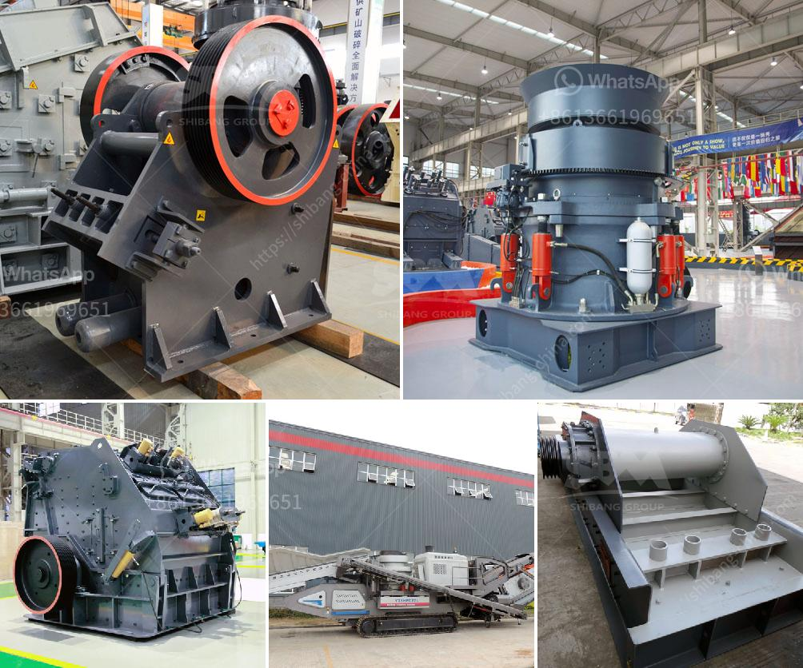

<h3>stone crushing industry in malaysia</h3>
Stone crushing industry is an important industrial sector in Malaysia. The crushed stone is then used as raw material for various construction activities i.e. construction of roads, bridges, buildings and canals. Over the last 10 years, the Construction sector in Malaysia has registered a strong growth rate and has become one of the most important sectors in the Malaysian economy.

The stone crushing industry plays a crucial role in Malaysia's economy. It contributes to the construction industry as well as provides employment opportunities for local residents. In Malaysia, the stone crushing industry has been growing rapidly due to increasing demand from the construction sector. The stone crushing market is segmented into brick manufacturing, concrete manufacturing, and rock quarrying. These three segments are expected to exhibit significant growth over the forecast period.

The stone crushing industry is largely concentrated in the states of Selangor, Johor, Perak, and Sarawak. These states have the highest number of stone crushing units in Malaysia. The stone crushing industry in Malaysia is facing various challenges including environmental and health-related problems, especially due to the extensive use of explosives and heavy machinery.

To ensure sustainable development, the Malaysian government has introduced several regulations and guidelines very recently. The Department of Environment has implemented stringent measures to control pollution caused by stone crushing activities. It requires all stone crushing units to obtain environmental clearance from the local authorities before operating. The clearance includes obtaining consent from the local community and implementing necessary pollution control measures.

The stone crushing industry in Malaysia also faces the challenge of waste disposal. Improper disposal of waste generated from stone crushing units leads to environmental pollution. The government has set up recycling centers in major cities to handle the waste generated from construction activities including stone crushing.

In addition to the environmental challenges, the stone crushing industry in Malaysia also faces a shortage of skilled manpower. The industry requires skilled and semi-skilled workers to operate and maintain the crushing units. To address this issue, the Malaysian government is encouraging vocational training institutes to provide specialized courses in stone crushing operations.

Despite the challenges, the stone crushing industry in Malaysia continues to grow and play a crucial role in the country's development. The availability of stone is abundant and the demand for crushed stone is on the rise due to the booming construction sector. With proper regulation and enforcement of environmental guidelines, the stone crushing industry can continue to contribute to Malaysia's economic growth while minimizing its adverse environmental impact.

To conclude, the stone crushing industry in Malaysia is an important sector for the country's economy and provides employment opportunities for local residents. With appropriate measures in place, it can contribute to sustainable development and help Malaysia build a stronger construction industry.
<h3>Contact us</h3><ul><li><strong>Whatsapp:&nbsp;<a href="https://wa.me/8613661969651">+8613661969651</a></strong></li><li><a href="https://swt.shibang-china.com/?git&amp;zhl&amp;stone crushing industry in malaysia"><strong>Online Service(chat now)</strong></a></li></ul><h3>Related</h3><ul><li><a href='two roll mill machine.md'>two roll mill machine</a></li><li><a href='millia deasel grinding mill and prices.md'>millia deasel grinding mill and prices</a></li><li><a href='uses of stone crusher equipment pdf.md'>uses of stone crusher equipment pdf</a></li><li><a href='handmade stone crusher.md'>handmade stone crusher</a></li><li><a href='stone sand making machine in nignia.md'>stone sand making machine in nignia</a></li></ul>