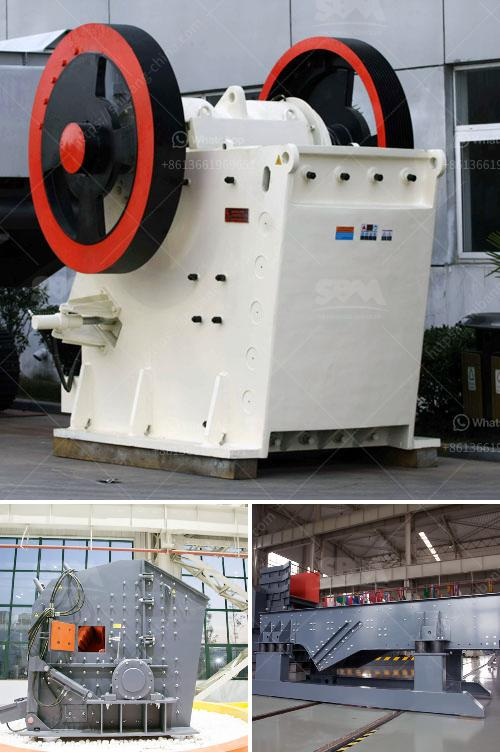

<h3>stone crushing machine price</h3>
Stone crushing machine plays an important role in industrial sectors such as mining, metallurgy, building material and chemicals. It can crush various materials and produce uniform particles, which makes it highly sought after by a wide range of buyers. With the increasing demand for stone crushing machines in the market, the price of these machines is also varying.

The price of stone crushing machines relies on several factors, including the production capacity, machine size, and quality. To choose the right machine for customers, it is crucial to consider these factors before making a purchase. Different types of stone crushing machines have their own specifications and functions, so customers should have a clear understanding of the materials they need to crush and select the appropriate machine accordingly.

In general, stone crushing machines with larger production capacity tend to be more expensive. Machines with smaller production capacity often have lower prices. Meanwhile, the machine size also affects the price. Larger machines require more materials and higher manufacturing costs, resulting in higher prices.

Additionally, the quality of stone crushing machines affects the price. Machines with superior quality and advanced technology are usually priced higher due to their better performance and longer lifespan. Investing in a high-quality machine may require a larger initial investment, but it can yield significant returns in the long run by reducing maintenance and replacement costs.

It is worth noting that the price of stone crushing machines can vary significantly from different manufacturers. When comparing prices, customers should not only focus on the final price, but also consider the after-sales service, warranty period, and technical support provided by the manufacturer.

In conclusion, the price of stone crushing machines is influenced by various factors, including production capacity, machine size, and quality. Customers should consider these factors carefully before making a purchase. It is recommended to choose high-quality machines from reputable manufacturers to ensure long-term use and maximum efficiency.
<h3>Contact us</h3><ul><li><strong>Whatsapp:&nbsp;<a href="https://wa.me/8613661969651">+8613661969651</a></strong></li><li><a href="https://swt.shibang-china.com/?git&amp;zhl&amp;stone crushing machine price"><strong>Online Service(chat now)</strong></a></li></ul><h3>Related</h3><ul><li><a href='stone powder milling small machine.md'>stone powder milling small machine</a></li><li><a href='clay crusher machine.md'>clay crusher machine</a></li><li><a href='trommel screen capacity calculation.md'>trommel screen capacity calculation</a></li><li><a href='impact crusher vsi price alibaba.md'>impact crusher vsi price alibaba</a></li><li><a href='processing of quartz crusher.md'>processing of quartz crusher</a></li></ul>