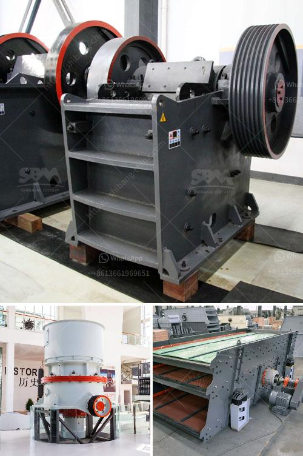

<h3>stone crushing machines for brick making</h3>
Stone crushing machines are essential for the construction industry, as they help break down larger rocks into smaller, more manageable sizes. These machines can be used to crush a variety of stones, such as limestone, granite, basalt, river pebble, and more. The stone crushing machines are used to crush the stones into smaller sizes so that they can be used in the construction industry.

One of the commonly used stone crushing machines is the jaw crusher. It is composed of two jaws, one of which is fixed and the other one is movable. The machine is used to reduce large rocks into smaller sizes for the next step of crushing. These machines are highly efficient and can handle very hard rocks.

Another type of stone crushing machine is the impact crusher, which is widely used in the construction industry. Compared to other crushers, it has larger reduction ratio and can fully utilize the high-speed impact energy of the entire rotor. However, due to its design, it requires more maintenance and is prone to wear and tear.

In addition to jaw crushers and impact crushers, cone crushers are also commonly used in the construction industry. They are capable of crushing rocks of various hardness levels and have a longer lifespan compared to the other stone crushing machines.

Stone crushing machines are used in a variety of fields such as construction materials, mining, metallurgy, highways, chemistry, railways, building materials industry, and more. To effectively ensure that these machines can be utilized to their fullest extent, operators should take into consideration a variety of factors, such as the characteristics of the stones to be crushed, the size of the stones, the required final product size, and the capacity of the machine.

In conclusion, stone crushing machines for brick making are essential for the construction industry. These machines can crush a variety of stones into smaller, more manageable sizes, which can then be used in construction projects. Whether it is jaw crushers, impact crushers or cone crushers, these machines play a crucial role in breaking down larger rocks and making them suitable for various construction applications.
<h3>Contact us</h3><ul><li><strong>Whatsapp:&nbsp;<a href="https://wa.me/8613661969651">+8613661969651</a></strong></li><li><a href="https://swt.shibang-china.com/?git&amp;zhl&amp;stone crushing machines for brick making"><strong>Online Service(chat now)</strong></a></li></ul><h3>Related</h3><ul><li><a href='stone crushing equipment.md'>stone crushing equipment</a></li><li><a href='correct feed of cone crushers.md'>correct feed of cone crushers</a></li><li><a href='design calculation of the jaw crusher pdf.md'>design calculation of the jaw crusher pdf</a></li><li><a href='sand making machine roller mill.md'>sand making machine roller mill</a></li><li><a href='jaw crusher materials.md'>jaw crusher materials</a></li></ul>