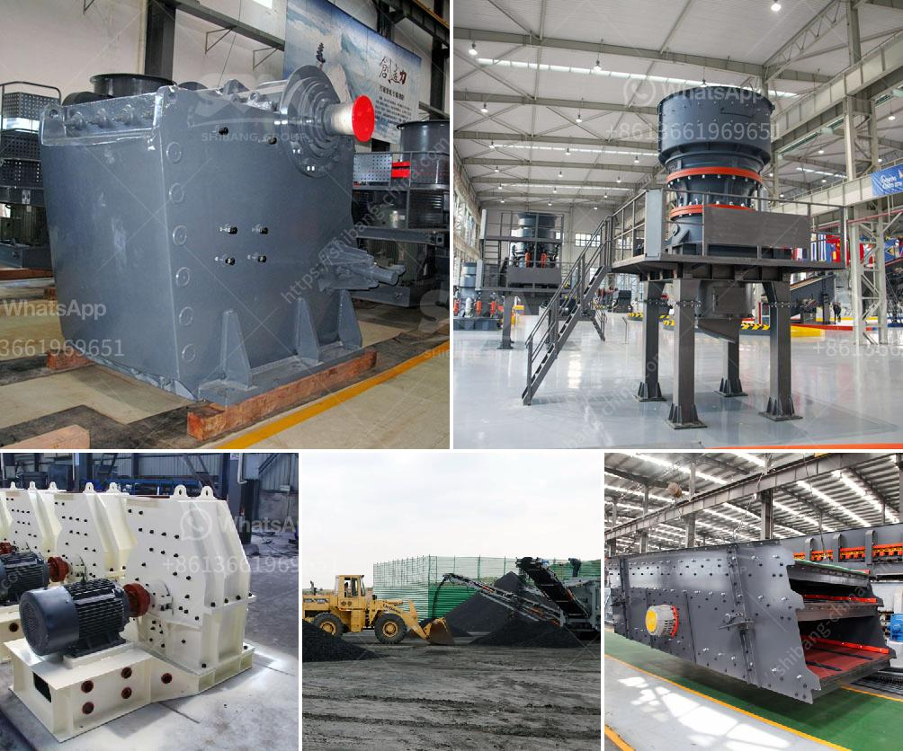

<h3>stone crushing plant cost</h3>
Stone crushing plant is a specialized production line aimed to produce building sand and stone, saving 50% energy than traditional stone production line. It enables the rock, sand, and gravel, cobble, and other materials to be made into various granularities conformed to the requirements of building sand. It is widely used in the industries of hydropower, building materials, highway, and urban construction.

The production capacity of a stone crushing plant varies widely depending on the needs of the customers. From a few to hundreds of tons per hour, the investment cost of the crushing plant also varies greatly. With 300-500 words, we can tell you that a plant with capacity 250-300 tons per hour costs around 600000-700000 USD.

Why is it so expensive? Well, firstly, the raw material is dumped into the vibrating feeder by a forklift or excavator. Then, the vibrating feeder evenly sends the raw materials into jaw crusher for primary crushing, and then the materials are sent into the impact crusher for secondary crushing. After this process, the vibrating screen separates the qualified stones from the materials that need to be crushed again.

But the production process does not end here. The vibrating feeder feeds the crushed materials into a cone crusher, which squeezes and grinds the materials, thereby obtaining a final product with particles of the required size. Finally, the stones are stored in a finished product warehouse, and the materials with particle sizes larger than the finished product are returned to the cone crusher for reprocessing.

From the above process, we can clearly see that the crushing plant requires multiple machines including crushers, vibrating feeders, and vibrating screens. These machines need to work together to complete the crushing process, which greatly affects the overall cost of the plant.

In addition to the equipment, the factors that influence the cost of stone crushing plant include material properties, desired output, transportation costs, installation costs, and maintenance costs. Among these factors, the type, quality, and model of the machine are the main determinants of the costs.

To sum up, the stone crushing plant cost is influenced by the machine type, brand, quality, and performance. The key equipment in the mining industry is impact crusher, cone crusher, sand making machine, vibrating screen and feeder, etc., causing crushing plant's death. For this reason, higher-quality crusher plants are more durable, lower maintenance costs and better performance. In turn, crusher plants with lower quality equipment tend to have a shorter lifespan, a less satisfactory performance, and higher maintenance costs.

Despite all of the above-mentioned challenges, investing in stone crushing plants is a smart and lucrative long-term option. Thus, knowing the factors that influence the cost of stone crushing plant is useful in your decision-making process.
<h3>Contact us</h3><ul><li><strong>Whatsapp:&nbsp;<a href="https://wa.me/8613661969651">+8613661969651</a></strong></li><li><a href="https://swt.shibang-china.com/?git&amp;zhl&amp;stone crushing plant cost"><strong>Online Service(chat now)</strong></a></li></ul><h3>Related</h3><ul><li><a href='sand screen with vibrator.md'>sand screen with vibrator</a></li><li><a href='price of iron ore crusher machine.md'>price of iron ore crusher machine</a></li><li><a href='portable concrete crusher construction waste.md'>portable concrete crusher construction waste</a></li><li><a href='kaolin stone crusher.md'>kaolin stone crusher</a></li><li><a href='vertical mill rock.md'>vertical mill rock</a></li></ul>