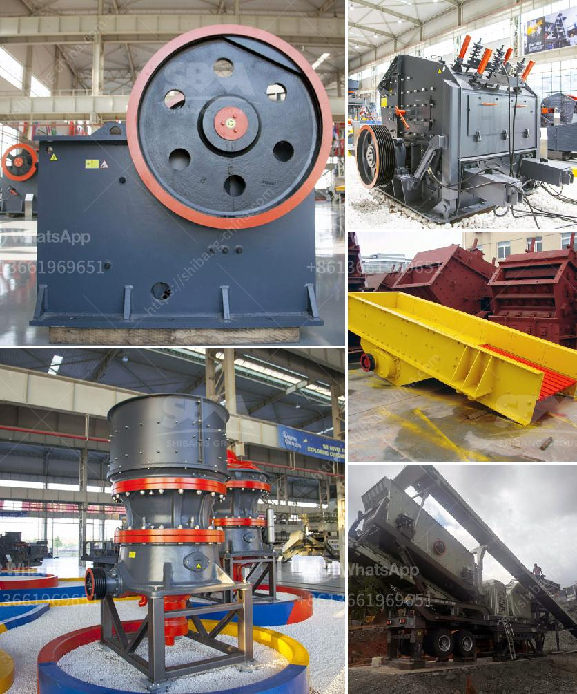

<h3>stone crushing plant layout</h3>
The fundamental goal for the design of a crushing plant is an installation that meets the required production requirements, operates at competitive cost, complies with today's tough environmental regulations, and can be built at a reasonable price despite the rising costs of equipment, energy and construction labor.

The crushing plant has two stages, the first being the extraction of stone from the quarry and the second being the crushing of the extracted stone into smaller sizes, suitable for various construction activities such as road, highway, bridges, buildings, canals etc. The extracted stone is uniformly fed into the jaw crusher through a vibrating feeder for primary crushing. The coarsely crushed stone is then transported by the belt conveyor to the impact crusher for secondary crushing. The finely crushed stone is sent to a vibrating screen to be separated into different sizes.

The layout of the stone crushing plant should be designed with consideration for the requirements of its final products, particle size, investment, budget, and many other factors that affect its production efficiency and quality. By designing a layout for the crushing plant, the number of crushing stages can be minimized, reducing both investment and operating costs.

Additionally, a properly designed plant layout eliminates unnecessary material handling, reduces the risk of accidents, and increases workforce productivity. For example, equipment such as conveyors and crushers can be positioned in such a way that they minimize the distance and height that stone must be transferred, reducing the risk of accidents and improving overall work efficiency.

Furthermore, a well-designed stone crushing plant layout balances the process flowsheet and optimum equipment selection, ensuring efficient operation and reducing production costs. This is achieved by combining appropriate equipment selection, efficient crushing and screening operations, and optimized utilization of machinery and manpower.

In conclusion, a well-designed stone crushing plant layout balances the capital and operating costs while maintaining the flexibility to meet varying production requirements. It should be noted that with careful planning and attention to detail, the layout of a crushing plant can help improve productivity, reduce energy consumption, and prolong equipment life expectancy. Therefore, hiring experienced engineers and consultants specializing in plant layout and design is essential for bringing the project from concept to reality, ultimately resulting in a highly efficient and cost-effective stone crushing plant.
<h3>Contact us</h3><ul><li><strong>Whatsapp:&nbsp;<a href="https://wa.me/8613661969651">+8613661969651</a></strong></li><li><a href="https://swt.shibang-china.com/?git&amp;zhl&amp;stone crushing plant layout"><strong>Online Service(chat now)</strong></a></li></ul><h3>Related</h3><ul><li><a href='ball mills south africa.md'>ball mills south africa</a></li><li><a href='ball mill 100tph catalog.md'>ball mill 100tph catalog</a></li><li><a href='crusher crusher run for sale in sabah.md'>crusher crusher run for sale in sabah</a></li><li><a href='millia deasel grinding mill and prices.md'>millia deasel grinding mill and prices</a></li><li><a href='sand screening machine south africa.md'>sand screening machine south africa</a></li></ul>