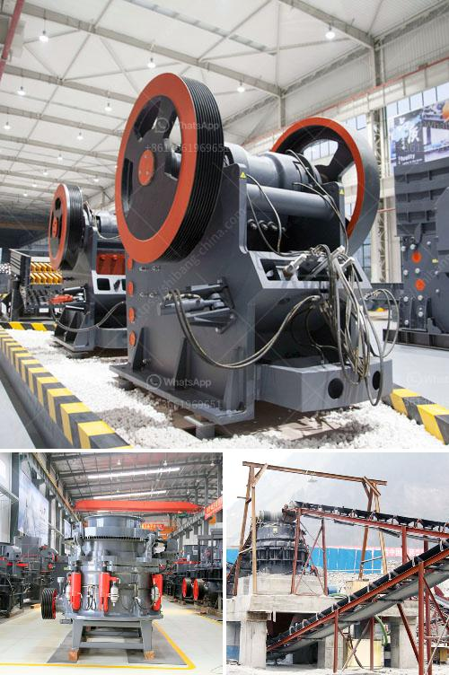

<h3>stone crushing plants in kenya</h3>
Stone crushing plants in Kenya are used to crush certain types of stones into smaller particles for various purposes such as building construction, road and highway projects, landscaping, and concrete production. In Kenya, these stone crushing plants produce different aggregates for use in the construction industry. Some of the products that these plants produce include gravel, ballast, granite chips, and rock stone.

Stone crushing is a painful and hazardous process that continues to be implemented in Kenya to date. Most individuals working in and around these plants constantly complain of the noise, dust, and other health hazards that come with the process. This article explores the various stone crushing plants in Kenya and the health and safety measures that can be implemented to minimize their negative impact on the environment and workers.

One of the stone crushing plants in Kenya is the Mwafrika Ballast Crushers, which is located along the Nairobi-Mombasa highway. It operates on a daily basis, producing crushed stones of various sizes for road and building construction. The smaller size stones are used for making concrete, while the larger sizes are used as ballast on railway tracks.

Despite the economic benefits associated with Mwafrika Ballast Crushers, its operations pose significant health risks to workers and nearby residents. The crushing process generates a lot of dust, which can cause respiratory problems and other health complications over time. Additionally, the noise from the machines can have adverse effects on the hearing capabilities of workers and residents.

To mitigate these risks, stone crushing plants in Kenya should implement various health and safety measures. Firstly, the plants can ensure that the crushing machines are properly enclosed, minimizing the amount of dust that escapes into the environment. Installing sealed doors and windows can also help to reduce noise pollution.

Furthermore, regular maintenance and cleaning of machines can prevent the accumulation of dust, minimizing the chances of respiratory problems. Adequate ventilation systems should also be installed to improve the air quality within the plants.

In addition to these measures, providing workers with personal protective equipment such as dust masks, goggles, and earplugs can go a long way in protecting their health. Regular health check-ups should also be carried out to detect any health problems at an early stage.

Stone crushing plant operators should also take responsibility for ensuring that workers are adequately trained on safety measures. They should be provided with proper training on how to operate the machines safely and how to use personal protective equipment correctly. Regular safety drills and workshops can equip workers with the necessary knowledge and skills to handle emergencies.

In conclusion, stone crushing plants in Kenya play a crucial role in the construction industry by providing various aggregates for different applications. However, the processes involved pose serious health risks to workers and nearby residents. It is imperative for stone crushing plants to implement effective health and safety measures to protect both their workers and the environment. By taking responsibility and investing in proper safety equipment, training, and maintenance, these plants can create a safer working environment and contribute to sustainable development in Kenya.
<h3>Contact us</h3><ul><li><strong>Whatsapp:&nbsp;<a href="https://wa.me/8613661969651">+8613661969651</a></strong></li><li><a href="https://swt.shibang-china.com/?git&amp;zhl&amp;stone crushing plants in kenya"><strong>Online Service(chat now)</strong></a></li></ul><h3>Related</h3><ul><li><a href='i want to buy china raymond grinding mill.md'>i want to buy china raymond grinding mill</a></li><li><a href='ball mill operating costs.md'>ball mill operating costs</a></li><li><a href='carbon black grinding.md'>carbon black grinding</a></li><li><a href='conveyor belt capacity ton per hours.md'>conveyor belt capacity ton per hours</a></li><li><a href='crusher portable mexico stone crusher.md'>crusher portable mexico stone crusher</a></li></ul>