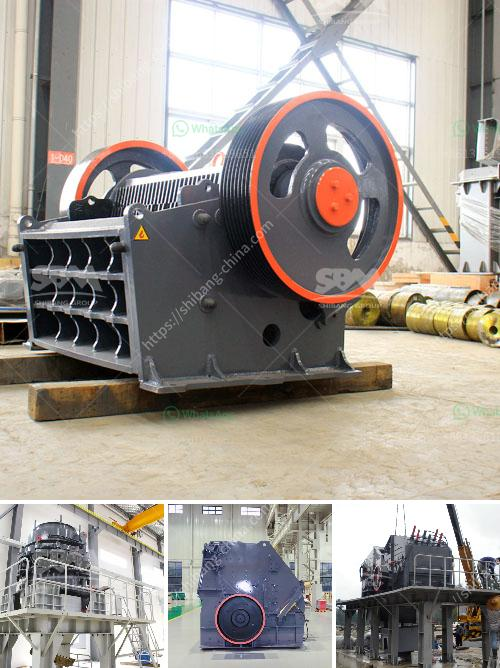

<h3>stone gravel crusher machine used for sale uae</h3>
Stone gravel crusher machine used for sale UAE is a machine that is capable of crushing and grinding rocks and ores into smaller pieces. The machine is commonly used in construction, mining, building, and road construction industries for reducing the size of stones and gravel. Some of the common materials that can be processed by the crusher machine include limestone, granite, marble, basalt, river gravel, and others.

The stone gravel crusher machine used for sale UAE can be configured to work with different types of materials and specifications. Depending on the crushing stage, feed size, and discharge size requirements, a variety of models are available to choose from. The machine comes with a powerful motor and a sturdy construction to ensure efficient and reliable performance.

One of the key benefits of using a stone gravel crusher machine is its versatility. The machine can handle a wide range of materials and produce different types of products. For example, it can produce aggregate for construction purposes, such as crushed stone, sand, and gravel. It can also be used to produce industrial materials like lime, gypsum, and cement.

The stone gravel crusher machine used for sale UAE is designed to be convenient to use and easy to maintain. It usually has a two or three-stage crushing system, which includes jaw crushers, impact crushers, cone crushers, and screening machines to separate the crushed stones into various sizes. Vibrating screens are usually used to separate the larger stones from the smaller ones.

In addition to its versatility, the stone gravel crusher machine used for sale UAE also has the advantage of low operating costs. The machine consumes less energy and requires less maintenance compared to other types of crushing equipment. This is particularly important in the UAE, where energy costs can be high.

When purchasing a stone gravel crusher machine used for sale UAE, it is important to consider several factors. First, the machine should be of high quality and able to withstand the demanding conditions of UAE's environment. Second, the machine should be able to produce the desired output size and meet the specific requirements of the project. Finally, it is important to choose a machine from a reliable supplier that offers good after-sales service and support.

In conclusion, the stone gravel crusher machine used for sale UAE is a versatile and cost-effective option for crushing and grinding rocks and ores. It is commonly used in construction, mining, building, and road construction industries for reducing the size of stones and gravel. The machine has the advantage of low operating costs, easy maintenance, and high efficiency. When purchasing a stone gravel crusher machine, it is important to consider the quality, output size, and after-sales support offered by the supplier.
<h3>Contact us</h3><ul><li><strong>Whatsapp:&nbsp;<a href="https://wa.me/8613661969651">+8613661969651</a></strong></li><li><a href="https://swt.shibang-china.com/?git&amp;zhl&amp;stone gravel crusher machine used for sale uae"><strong>Online Service(chat now)</strong></a></li></ul><h3>Related</h3><ul><li><a href='vibrating screens australia.md'>vibrating screens australia</a></li><li><a href='crusher and screen plant for sale japan.md'>crusher and screen plant for sale japan</a></li><li><a href='belt conveyor europe.md'>belt conveyor europe</a></li><li><a href='price of small scale cement plant in india.md'>price of small scale cement plant in india</a></li><li><a href='gypsum crushing process.md'>gypsum crushing process</a></li></ul>