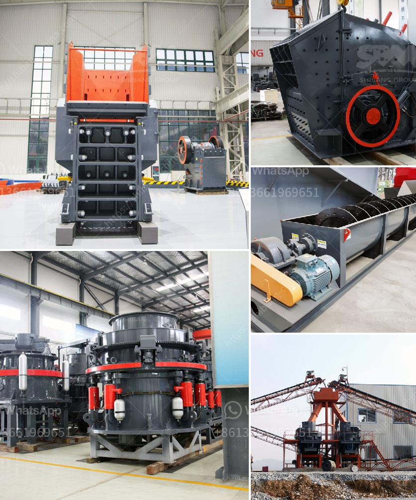

<h3>stone grinding plant</h3>
Stone grinding plant refers to the stone grinding equipment used in the production of industrial materials such as stone powder. It is an important equipment in the industrial milling industry. The application of stone grinding plant not only brings huge economic benefits to the enterprise, but also contributes to the protection of the environment.

Stone grinding plant is commonly used in the production of various stone powders with different fineness. The main equipment of the plant includes jaw crusher, hammer crusher, Raymond mill, bucket elevator, and electromagnetic vibrating feeder. These devices are mainly used for the crushing and grinding of materials, and can process materials with a Mohs hardness of 9.3 or lower and a humidity of less than 6%. The final product can be adjusted freely in the range of 80-325 mesh.

The stone grinding plant has many advantages in the industrial milling industry. Firstly, it produces stone powder with various fineness, which can be used in many industries such as construction, chemical, metallurgy, and agriculture. For example, fine stone powder can be used as raw materials for cement production, filler for coatings, rubber and plastics, and as an additive for fertilizers. Secondly, the stone grinding plant has high efficiency and low energy consumption. The advanced grinding principle and system greatly improve the grinding efficiency, and the energy-saving effect is remarkable. In addition, the stone grinding plant has a small footprint, which saves a lot of land resources for the enterprise. Moreover, the plant is equipped with a dust removal device, which effectively reduces the dust pollution and meets the environmental protection requirements.

Stone grinding plant has a wide range of applications. It can grind various non-flammable and explosive materials with a hardness of less than 7 and a humidity of less than 6%, such as limestone, marble, gypsum, barite, kaolin, talc, dolomite, calcite, and other rocks and ores. These materials have a wide range of uses and high economic value. The stone grinding plant can process these materials into high-quality stone powder, which is favored by many industries.

In summary, stone grinding plant is an important equipment in the industrial milling industry. It not only brings huge economic benefits to the enterprise, but also contributes to the protection of the environment. With the continuous development of technology, the stone grinding plant will have more advanced functions and wider applications, further promoting the development of the industrial milling industry.
<h3>Contact us</h3><ul><li><strong>Whatsapp:&nbsp;<a href="https://wa.me/8613661969651">+8613661969651</a></strong></li><li><a href="https://swt.shibang-china.com/?git&amp;zhl&amp;stone grinding plant"><strong>Online Service(chat now)</strong></a></li></ul><h3>Related</h3><ul><li><a href='indonesia crushers of how much price.md'>indonesia crushers of how much price</a></li><li><a href='china stone grinding mill.md'>china stone grinding mill</a></li><li><a href='china quarry plant manufacturers.md'>china quarry plant manufacturers</a></li><li><a href='clay beneficiation process.md'>clay beneficiation process</a></li><li><a href='talc powder conveying systems.md'>talc powder conveying systems</a></li></ul>