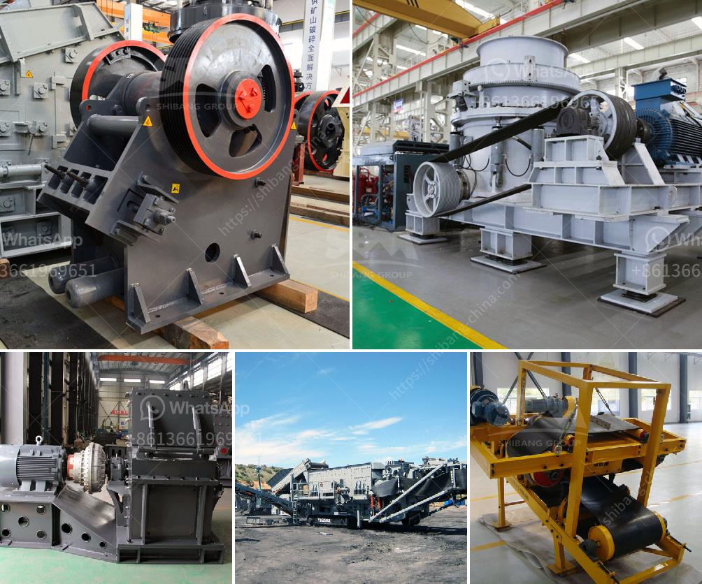

<h3>stone mining in meghalaya</h3>
Meghalaya, a small state in North-Eastern region of India, is abundantly blessed with coal and limestone. About 9% of the country's total limestone reserves are distributed in the state. Mining is carried out by open cast method of mining which is taking place at both large scale and small scale levels. The limestone mined is used chiefly for the manufacturing of cement, lime and edible lime etc. Scientific studies revealed that loss of forest cover, pollution of water, soil and air, depletion of natural flora and fauna, reduction in biodiversity, erosion of soil, instability of soil and rock masses, changes in landscape and degradation of agriculture land are some of the conspicuous environmental implications of coal mining.

One of the major problems of the mines is the discharge of acidic water and oil into the rivers. Acidic water affects the aquatic life, impacting fishermen who rely on fishing for their livelihoods. Apart from the ecological damage, mining also puts the lives of the miners at risk. Many accidents have occurred in coal mines, resulting in deaths and disabling injuries of workers due to falls of roof and rib, falls of persons, blasts, transportation and operation etc.

A clear picture of the conveyer belt system used in Meghalaya can be seen. In this process, the coal miners grab freshly-cut pieces of coal and drop them onto a conveyor belt perpendicular to the seams from which they were mined. The coal falls on a slab called "pala" which then falls onto another conveyor belt. The miners engage in an intricate dance as they work, balancing on precarious ledges of coal or stone with little to no protective equipment.

Despite the environmental and safety concerns, stone mining continues unabated in Meghalaya. The primary reason is the lack of regulations and minimal enforcement by the state government. The situation is worsened by the involvement of unlicensed operators who exploit the natural resources without any regard for their sustainable management.

There is an urgent need for the government to intervene and address the stone mining issue in Meghalaya. Stringent laws and regulations should be put in place to protect the environment and the lives of the miners. Additionally, proper rehabilitation and compensation schemes must be implemented for affected communities. By doing so, we can ensure sustainable mining practices that prioritize both environmental conservation and human well-being.
<h3>Contact us</h3><ul><li><strong>Whatsapp:&nbsp;<a href="https://wa.me/8613661969651">+8613661969651</a></strong></li><li><a href="https://swt.shibang-china.com/?git&amp;zhl&amp;stone mining in meghalaya"><strong>Online Service(chat now)</strong></a></li></ul><h3>Related</h3><ul><li><a href='crushing plant suppliers in pakistan.md'>crushing plant suppliers in pakistan</a></li><li><a href='barite bulking process.md'>barite bulking process</a></li><li><a href='second hand gold mining equipments in uk.md'>second hand gold mining equipments in uk</a></li><li><a href='stone crusher plant management.md'>stone crusher plant management</a></li><li><a href='artificial stone production plant in turkey.md'>artificial stone production plant in turkey</a></li></ul>